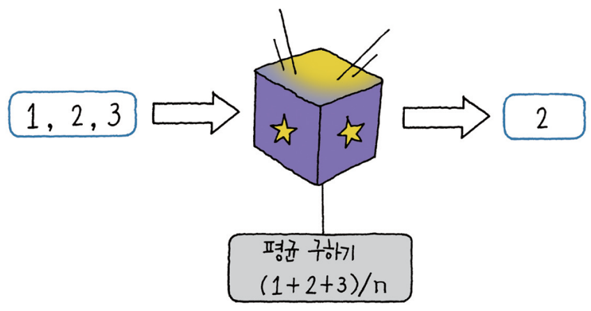
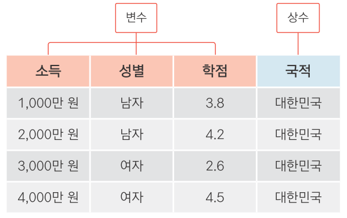
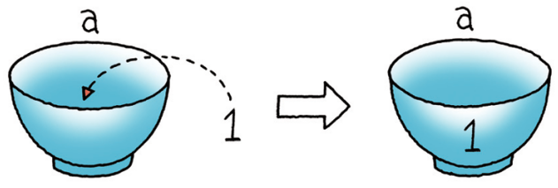
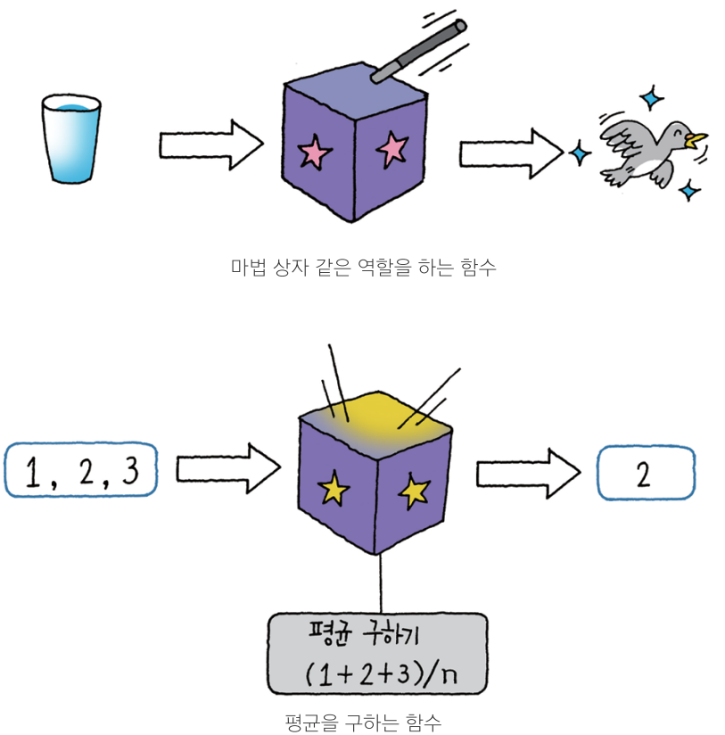
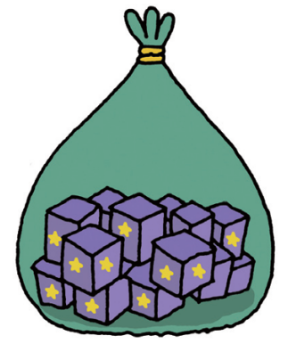

---
output:
  word_document: default
---
<!-- RMD 설정 -->
```{r, include=F}
Sys.setenv("LANGUAGE"="EN")
library(dplyr)
library(ggplot2)
```

# 3. 데이터 분석을 위한 연장 챙기기



##### NP #####

## 03-1. 변하는 수, '변수' 이해하기

**변수(Variable)**

  - 다양한 값을 지니고 있는 하나의 속성
  - 변수는 데이터 분석의 대상



##### NP #####

### 변수 만들기



```{r}
a <- 1
a

b <- 2
b

c <- 3
c

d <- 3.5
d
```

##### NP #####

#### 변수로 연산하기
```{r}
a+b
a+b+c
4/b
5*b
```


##### NP #####

### 여러 값으로 구성된 변수 만들기

#### c()
```{r}
var1 <- c(1, 2, 5, 7, 8)    # 숫자 다섯 개로 구성된 var1 생성
var1

var2 <- c(1:5)              # 1~5까지 연속값으로 var2 생성
var2
```

##### NP #####

### seq()
```{r}
var3 <- seq(1, 5)           # 1~5까지 연속값으로 var3 생성
var3

var4 <- seq(1, 10, by = 2)  # 1~10까지 2 간격 연속값으로 var4 생성
var4

var5 <- seq(1, 10, by = 3)  # 1~10까지 3 간격 연속값으로 var5 생성
var5
```

##### NP #####

####연속값 변수로 연산하기 
```{r}
var1
var1+2

var1
var2
var1+var2
```  

##### NP #####

####문자로 된 변수 만들기
```{r}
str1 <- "a"
str1

str2 <- "text"
str2

str3 <- "Hello World!"
str3

```

##### NP #####

####연속 문자 변수 만들기
```{r}
str4 <- c("a", "b", "c")
str4

str5 <- c("Hello!", "World", "is", "good!")
str5
```

##### NP #####

#### 문자로 된 변수로는 연산할 수 없다
```{r, error=T}
str1+2
```

##### NP #####

## 03-2. 마술 상자 같은 '함수' 이해하기

**함수**

- 값을 넣으면 특정한 기능을 수행해 처음과 다른 값이 출력됨



### 숫자를 다루는 함수 이용하기

```{r}
# 변수 만들기
x <- c(1, 2, 3)
x

# 함수 적용하기
mean(x)
max(x)
min(x)
```

##### NP #####

### 문자를 다루는 함수 이용하기

```{r}
str5

paste(str5, collapse = ",")  # 쉼표를 구분자로 str4의 단어들 하나로 합치기
```

##### NP #####

#### 함수의 옵션 설정하기 - 파라미터
```{r}
paste(str5, collapse = " ")
```

#### 함수의 결과물로 새 변수 만들기
```{r}
x_mean <- mean(x)
x_mean

str5_paste <- paste(str5, collapse = " ")
str5_paste
```

##### NP #####

## 03-3. 함수 꾸러미, '패키지' 이해하기


**패키지(packages)**

- 함수가 여러 개 들어 있는 꾸러미
- 하나의 패키지 안에 다양한 함수가 들어있음
- 함수를 사용하려면 패키지 설치 먼저 해야함

  


### ggplot2 패키지 설치하기, 로드하기

```{r, eval=F}
install.packages("ggplot2")  # ggplot2 패키지 설치
library(ggplot2)             # ggplot2 패키지 로드
```

##### NP #####

#### 함수 사용하기
```{r}
# 여러 문자로 구성된 변수 생성
x <- c("a", "a", "b", "c")
x

# 빈도 그래프 출력
qplot(x)
```

##### NP #####

#### ggplot2의 mpg 데이터로 그래프 만들기
```{r, message=F}
# data에 mpg, x축에 hwy 변수 지정하여 그래프 생성
qplot(data = mpg, x = hwy)
```

##### NP #####

#### qplot() 파라미터 바꿔보기
```{r, message=F}
# x축 cty
qplot(data = mpg, x = cty)
```

##### NP #####

```{r, message=F}
# x축 drv, y축 hwy
qplot(data = mpg, x = drv, y = hwy)
```

##### NP #####

```{r, message=F}
# x축 drv, y축 hwy, 선 그래프 형태
qplot(data = mpg, x = drv, y = hwy, geom = "line")
```

##### NP #####

```{r, message=F}
# x축 drv, y축 hwy, 상자 그림 형태
qplot(data = mpg, x = drv, y = hwy, geom = "boxplot")
```

##### NP #####

```{r, message=F}
# x축 drv, y축 hwy, 상자 그림 형태, drv별 색 표현
qplot(data = mpg, x = drv, y = hwy, geom = "boxplot", colour = drv)
```

##### NP #####

#### 함수의 기능이 궁금할 땐 Help 함수를 활용해 보세요
```{r, eval=F}
?qplot
```

##### NP #####

### 혼자서 해보기

#### Q1. 시험 점수 변수 만들고 출력하기

다섯 명의 학생이 시험을 봤습니다. 학생 다섯 명의 시험 점수를 담고 있는 변수를 만들어 출력해 보세요. 각 학생의 시험
점수는 다음과 같습니다.

`80, 60, 70, 50, 90`

#### Q2. 전체 평균 구하기

앞 문제에서 만든 변수를 이용해서 이 학생들의 전체 평균 점수를 구해보세요.

#### Q3. 전체 평균 변수 만들고 출력하기

전체 평균 점수를 담고 있는 새 변수를 만들어 출력해 보세요. 앞 문제를 풀 때 사용한 코드를 응용하면 됩니다.

##### NP #####

### 정답

#### Q1. 시험 점수 변수 만들고 출력하기
```{r}
score <- c(80, 60, 70, 50, 90)
score
```

#### Q2. 전체 평균 구하기
```{r}
mean(score)
```

#### Q3. 전체 평균 변수 만들고 출력하기
```{r}
mean_score <- mean(score)
mean_score
```
