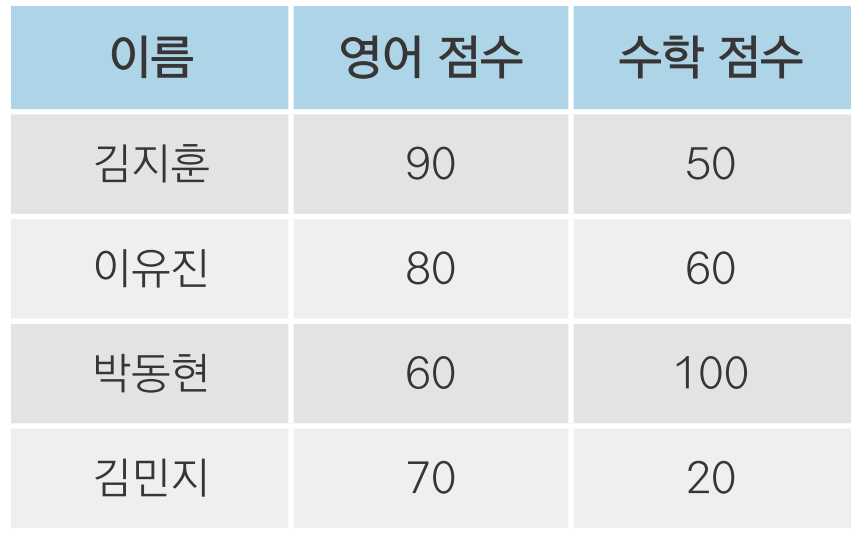
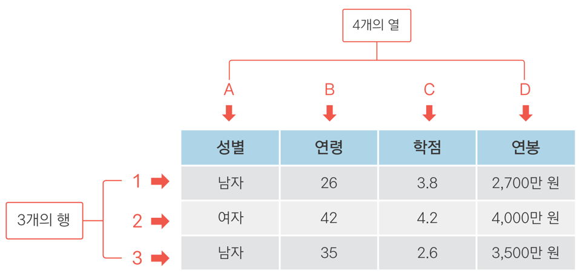
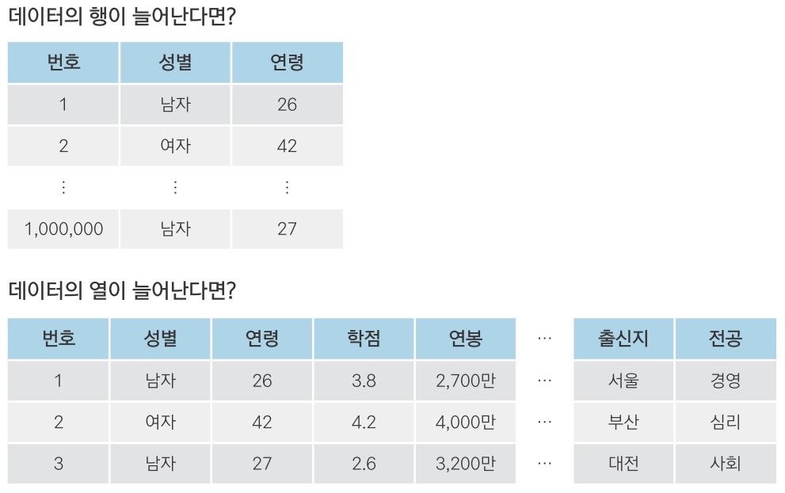

---
output:
  word_document: default
---
<!-- RMD 설정 -->
```{r, include=F}
Sys.setenv("LANGUAGE"="EN")
library(dplyr)
library(ggplot2)
```

# 4. 데이터 프레임의 세계로!



##### NP #####

## 04-1. 데이터는 어떻게 생겼나? - 데이터 프레임 이해하기

#### 데이터 프레임


##### NP #####

#### 데이터 프레임



- '열'은 속성

- '행'은 한 사람의 정보

##### NP #####

#### 데이터가 크다 = 행이 많다 또는 열이 많다



##### NP #####

## 04-2. 데이터 프레임 만들기 - 시험 성적 데이터를 만들어 보자!

### 데이터 입력해 데이터 프레임 만들기
```{r}
english <- c(90, 80, 60, 70)  # 영어 점수 변수 생성
english

math <- c(50, 60, 100, 20)    # 수학 점수 변수 생성
math

# english, math로 데이터 프레임 생성해서 df_midterm에 할당
df_midterm <- data.frame(english, math)
df_midterm
```

##### NP #####

```{r}
class <- c(1, 1, 2, 2)
class

df_midterm <- data.frame(english, math, class)
df_midterm

mean(df_midterm$english)  # df_midterm의 english로 평균 산출
mean(df_midterm$math)     # df_midterm의 math로 평균 산술

```

##### NP #####

#### 데이터 프레임 한 번에 만들기
```{r}
df_midterm <- data.frame(english = c(90, 80, 60, 70),
                         math = c(50, 60, 100, 20),
                         class = c(1, 1, 2, 2))
df_midterm
```


##### NP #####

### 혼자서 해보기

#### Q1. `data.frame()`과 `c()`를 조합해서 표의 내용을 데이터 프레임으로 만들어 출력해보세요. 

제품  | 가격 | 판매량
------|------|-------
사과  |1800  | 24
딸기  |1500  | 38
수박  |3000  | 13

#### Q2. 앞에서 만든 데이터 프레임을 이용해서 과일 가격 평균, 판매량 평균을 구해보세요.

##### NP #####

### 정답

#### Q1. `data.frame()`과 `c()`를 조합해서 표의 내용을 데이터 프레임으로 만들어 출력해보세요. 
```{r}
# 데이터 프레임 만들기
sales <- data.frame(fruit = c("사과", "딸기", "수박"),
                    price = c(1800, 1500, 3000),
                    volume = c(24, 38, 13))

# 데이터 프레임 출력하기
sales
```

#### Q2. 앞에서 만든 데이터 프레임을 이용해서 과일 가격 평균, 판매량 평균을 구해보세요.
```{r}
mean(sales$price)   # 가격 평균
mean(sales$volume)  # 판매량 평균
```

##### NP #####

### 04-3. 외부 데이터 이용하기 - 축적된 시험 성적 데이터를 불러오자!

#### 엑셀 파일 불러오기

```{r eval=FALSE}
# readxl 패키지 설치
install.packages("readxl")
```

```{r}
# readxl 패키지 로드
library(readxl)
```

##### NP #####

```{r}
df_exam <- read_excel("excel_exam.xlsx")  # 엑셀 파일을 불러와서 df_exam에 할당
df_exam                                   # 출력

mean(df_exam$english)
mean(df_exam$science)
```

##### NP #####

#### 직접 경로 지정
```{r, eval=F}
df_exam <- read_excel("d:/easy_r/excel_exam.xlsx")
```

> [주의] Working directory에 불러올 파일이 있어야 함

##### NP #####


#### 엑셀 파일 첫 번째 행이 변수명이 아니라면?
```{r, eval=F}
df_exam_novar <- read_excel("excel_exam_novar.xlsx", col_names = F)
df_exam_novar
```

#### 엑셀 파일에 시트가 여러 개 있다면?
```{r, eval=F}
df_exam_sheet <- read_excel("excel_exam_sheet.xlsx", sheet = 3)
df_exam_sheet
```

##### NP #####

#### csv 파일 불러오기
- 범용 데이터 형식
- 값 사이를 쉼표(,)로 구분
- 용량 작음, 다양한 소프트웨어에서 사용

```{r}
df_csv_exam <- read.csv("csv_exam.csv")
df_csv_exam
```

##### NP #####

#### 문자가 들어 있는 파일을 불러올 때는 `stringsAsFactors = F`
```{r, eval=F}
df_csv_exam <- read.csv("csv_exam.csv", stringsAsFactors = F)
```

##### NP #####

### 데이터 프레임을 CSV 파일로 저장하기
```{r}
df_midterm <- data.frame(english = c(90, 80, 60, 70),
                         math = c(50, 60, 100, 20),
                         class = c(1, 1, 2, 2))
df_midterm

write.csv(df_midterm, file = "df_midterm.csv")
```

##### NP #####

### RData 파일 활용하기
- R 전용 데이터 파일
- 용량 작고 빠름

#### 데이터 프레임을 RData 파일로 저장하기
```{r}
save(df_midterm, file = "df_midterm.rda")
```

#### RData 불러오기
```{r, error=T}
rm(df_midterm)

df_midterm

load("df_midterm.rda")

df_midterm
```

##### NP #####

#### 다른 파일을 불러올 때와 차이점
- 엑셀, CSV는 파일을 불러와 새 변수에 할당해서 활용
- rda는 불러오면 저장한 데이터 프레임이 자동 생성됨. 할당 없이 바로 활용
```{r, eval=F}
# 엑셀 파일 불러와 df_exam에 할당하기
df_exam <- read_excel("excel_exam.xlsx")  
 
# csv 파일 불러와 df_csv_exam 에 할당하기
df_csv_exam <- read.csv("csv_exam.csv")   
 
# Rda 파일 불러오기
load("df_midterm.rda")
```

##### NP #####

### 정리하기

```{r, eval=F}
# 1.변수 만들기, 데이터 프레임 만들기
english <- c(90, 80, 60, 70)  # 영어 점수 변수 생성
math <- c(50, 60, 100, 20)    # 수학 점수 변수 생성
data.frame(english, math)     # 데이터 프레임 생성

# 2. 외부 데이터 이용하기

# 엑셀 파일
library(readxl)                                 # readxl 패키지 로드
df_exam <- read_excel("excel_exam.xlsx")        # 엑셀 파일 불러오기

# CSV 파일
df_csv_exam <- read.csv("csv_exam.csv")         # CSV 파일 불러오기
write.csv(df_midterm, file = "df_midterm.csv")  # CSV 파일로 저장하기

# Rda 파일
load("df_midterm.rda")                          # Rda 파일 불러오기
save(df_midterm, file = "df_midterm.rda")       # Rda 파일로 저장하기
```


