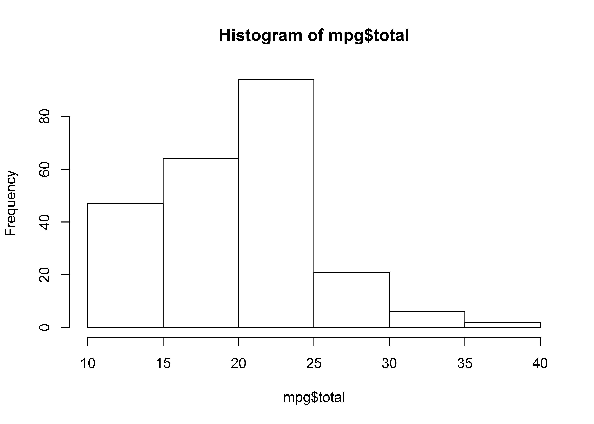
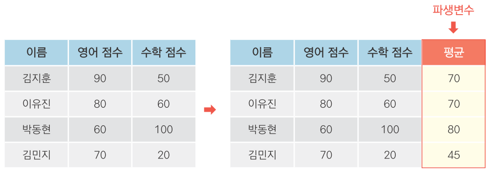
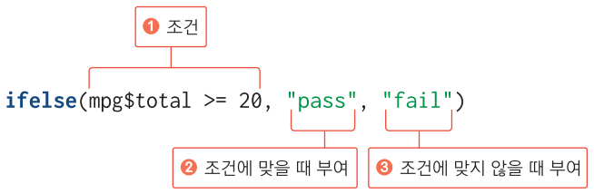

---
output:
  word_document: default
  html_document: default
---
<!-- RMD 설정 -->
```{r, include=F}
Sys.setenv("LANGUAGE"="EN")
library(dplyr)
library(ggplot2)
```

# 5. 데이터 분석 기초!

## 데이터 파악하기, 다루기 쉽게 수정하기



##### NP #####


## 05-1. 데이터 파악하기

|함수     |기능
|---------|------------------
|head()   |데이터 앞부분 출력
|tail()   |데이터 뒷부분 출력
|View()   |뷰어 창에서 데이터 확인
|dim()    |데이터 차원 출력
|str()    |데이터 속성 출력
|summary()|요약통계량 출력       

##### NP #####

### exam 데이터 파악하기

#### 데이준 준비
```{r}
exam <- read.csv("csv_exam.csv")
```

##### NP #####

#### head() - 데이터 앞부분 확인하기
```{r}
head(exam)      # 앞에서부터 6행까지 출력
head(exam, 10)  # 앞에서부터 10행까지 출력
```

##### NP #####

#### tail() - 데이터 뒷부분 확인하기

```{r}
tail(exam)      # 뒤에서부터 6행까지 출력
tail(exam, 10)  # 뒤에서부터 10행까지 출력
```

##### NP #####

#### View() - 뷰어 창에서 데이터 확인하기

```{r, eval=F}
View(exam)
```

> [유의] View()에서 맨 앞의 V는 대문자

##### NP #####

#### dim() - 몇 행 몇 열로 구성되는지 알아보기

```{r}
dim(exam)  # 행, 열 출력
```


##### NP #####

#### str() - 속성 파악하기

```{r}
str(exam)  # 데이터 속성 확인
```

##### NP #####

#### summary() - 요약통계량 산출하기

```{r}
summary(exam)  # 요약통계량 출력
```

##### NP #####

### mpg 데이터 파악하기
```{r}
# ggplo2의 mpg 데이터를 데이터 프레임 형태로 불러오기
mpg <- as.data.frame(ggplot2::mpg)
```

##### NP #####

### mpg 데이터 파악하기

```{r}
head(mpg)    # Raw 데이터 앞부분 확인
tail(mpg)    # Raw 데이터 뒷부분 확인
```

##### NP #####

```{r, eval=F}
View(mpg)    # Raw 데이터 뷰어 창 확인
```

```{r}
dim(mpg)     # 행, 열 출력
str(mpg)     # 데이터 속성 확인
```

##### NP #####

```{r}
summary(mpg)  # 요약통계량 출력
```


##### NP #####

## 2. 데이터 수정하기 - 변수명 바꾸기

#### dplyr 패키지 설치 & 로드
```{r, eval=FALSE}
install.packages("dplyr")  # dplyr 설치
library(dplyr)             # dplyr 로드
```

<!-- 실행용 코드, 안보여줌 -->
```{r, include=FALSE}
library(dplyr)             # dplyr 패키지 로드
```

##### NP #####

#### 데이터 프레임 생성

```{r}
df_raw <- data.frame(var1 = c(1, 2, 1),
                     var2 = c(2, 3, 2))
df_raw
```

##### NP #####

#### 1. 데이터 프레임 복사본 만들기

```{r}
df_new <- df_raw  # 복사본 생성
df_new            # 출력
```

##### NP #####

#### 2. 변수명 바꾸기

```{r}
df_new <- rename(df_new, v2 = var2)  # var2를 v2로 수정
df_new
```

> [유의] rename()에 '새 변수명 = 기존 변수명' 순서로 입력

##### NP #####

#### 수정 전후 비교

```{r}
df_raw
df_new
```


##### NP #####


### 혼자서 해보기

`mpg` 데이터의 변수명은 긴 단어를 짧게 줄인 축약어로 되어있습니다. `cty` 변수는 도시 연비, `hwy` 변수는 고속도로 연비를 의미합니다. 변수명을 이해하기 쉬운 단어로 바꾸려고 합니다. `mpg` 데이터를 이용해서 아래 문제를 해결해 보세요.

- Q1. `ggplot2` 패키지의 `mpg` 데이터를 사용할 수 있도록 불러온 뒤 복사본을 만드세요.
- Q2. 복사본 데이터를 이용해서 `cty`는 `city`로, `hwy`는 `highway`로 변수명을 수정하세요.
- Q3. 데이터 일부를 출력해서 변수명이 바뀌었는지 확인해 보세요. 아래와 같은 결과물이 출력되어야 합니다.

<!-- 코드 미출력, 결과물 생성 위한 실행 -->
```{r, include=FALSE}
mpg <- as.data.frame(ggplot2::mpg)         # mpg 데이터 불러오기
mpg_new <- mpg                             # 복사본 만들기
mpg_new <- rename(mpg_new, city = cty)     # cty를 city로 수정
mpg_new <- rename(mpg_new, highway = hwy)  # hwy를 highway로 수정
```

<!-- 코드 없이 결과물만 출력 -->
```{r, echo=F}
head(mpg_new)
```

##### NP #####

### 정답

Q1. `ggplot2` 패키지의 `mpg` 데이터를 사용할 수 있도록 불러온 뒤 복사본을 만드세요.
```{r}
mpg <- as.data.frame(ggplot2::mpg)         # mpg 데이터 불러오기
mpg_new <- mpg                             # 복사본 만들기
```

Q2. 복사본 데이터를 이용해서 `cty`는 `city`로, `hwy`는 `highway`로 변수명을 수정하세요.
```{r}
mpg_new <- rename(mpg_new, city = cty)     # cty를 city로 수정
mpg_new <- rename(mpg_new, highway = hwy)  # hwy를 highway로 수정
``` 

Q3. 데이터 일부를 출력해서 변수명이 바뀌었는지 확인해 보세요. 아래와 같은 결과물이 출력되어야 합니다.
```{r}
head(mpg_new)                              # 데이터 일부 출력
```

##### NP #####

## 05-3. 파생변수 만들기



##### NP #####

### 변수 조합해 파생변수 만들기

#### 데이터 프레임 생성
```{r}
df <- data.frame(var1 = c(4, 3, 8),
                 var2 = c(2, 6, 1))
df
```

##### NP

#### 파생변수 생성
```{r}
df$var_sum <- df$var1 + df$var2  # var_sum 파생변수 생성
df
```

##### NP

#### 파생변수 생성
```{r}
df$var_mean <- (df$var1 + df$var2)/2  # var_mean 파생변수 생성
df
```

##### NP

### mpg 통합 연비 변수 만들기
```{r}
mpg$total <- (mpg$cty + mpg$hwy)/2  # 통합 연비 변수 생성
head(mpg)
mean(mpg$total)
```

##### NP

### 조건문을 활용해 파생변수 만들기

#### 1.기준값 정하기

```{r}
summary(mpg$total)  # 요약 통계량 산출
hist(mpg$total)     # 히스토그램 생성
```

##### NP

#### 2. 조건문으로 합격 판정 변수 만들기



```{r}
# 20 이상이면 pass, 그렇지 않으면 fail 부여
mpg$test <- ifelse(mpg$total >= 20, "pass", "fail")
```

##### NP #####

```{r}
head(mpg, 20) # 데이터 확인
```

##### NP

#### 3. 빈도표로 합격 판정 자동차 수 살펴보기
```{r}
table(mpg$test)  # 연비 합격 빈도표 생성
```

##### NP

#### 4. 막대 그래프빈 빈도 표현하기
```{r, message=F}
library(ggplot2)  # ggplot2 로드
qplot(mpg$test)   # 연비 합격 빈도 막대 그래프 생성
```

##### NP

### 중첩 조건문 활용하기 - 연비 등급 변수 만들기

등급|total 기준
:--:|:--:
A   |30 이상
B   |20~29
C   |20 미만

##### NP

```{r}
# total을 기준으로 A, B, C 등급 부여
mpg$grade <- ifelse(mpg$total >= 30, "A",
                    ifelse(mpg$total >= 20, "B", "C"))

head(mpg, 20)  # 데이터 확인
```

> [유의] ifelse()가 두 번 반복되므로 열리는 괄호와 닫히는 괄호가 각각 두 개, 쉼표도 각각 두 개

##### NP

#### 빈도표, 막대 그래프로 연비 등급 살펴보기
```{r}
table(mpg$grade) # 등급 빈도표 생성
qplot(mpg$grade) # 등급 빈도 막대 그래프 생성
```


### 원하는 만큼 범주 만들기
```{r, eval=F}
# A, B, C, D 등급 부여
mpg$grade2 <- ifelse(mpg$total >= 30, "A",
                     ifelse(mpg$total >= 25, "B",
                            ifelse(mpg$total >= 20, "C", "D")))
```


##### NP


### 정리하기

```{r, eval=F}
# 1.데이터 준비, 패키지 준비
mpg <- as.data.frame(ggplot2::mpg)  # 데이터 불러오기
library(dplyr)                      # dplyr 로드
library(ggplot2)                    # ggplot2 로드

# 2.데이터 파악
head(mpg)     # Raw 데이터 앞부분
tail(mpg)     # Raw 데이터 뒷부분
View(mpg)     # Raw 데이터 뷰어창에서 확인
dim(mpg)      # 차원
str(mpg)      # 속성
summary(mpg)  # 요약 통계량
```

##### NP

### 정리하기

```{r, eval=F}
# 3.변수명 수정
mpg <- rename(mpg, company = manufacturer)

# 4.파생변수 생성
mpg$total <- (mpg$cty + mpg$hwy)/2                   # 변수 조합
mpg$test <- ifelse(mpg$total >= 20, "pass", "fail")  # 조건문 활용

# 5.빈도 확인
table(mpg$test)  # 빈도표 출력
qplot(mpg$test)  # 막대 그래프 생성
```

##### NP


## 분석 도전!

`ggplot2` 패키지에는 미국 동북중부 437개 지역의 인구통계 정보를 담은 `midwest`라는 데이터가 포함되어 있습니다. `midwest` 데이터를 사용해 데이터 분석 문제를 해결해보세요.


- 문제1. `ggplot2`의 `midwest` 데이터를 데이터 프레임 형태로 불러와서 데이터의 특성을 파악하세요.

- 문제2. `poptotal`(전체 인구)을 `total`로, `popasian`(아시아 인구)을 `asian`으로 변수명을 수정하세요.

- 문제3. `total`, `asian` 변수를 이용해 '전체 인구 대비 아시아 인구 백분율' 파생변수를 만들고, 히스토그램을 만들어 도시들이 어떻게 분포하는지 살펴보세요.

- 문제4. 아시아 인구 백분율 전체 평균을 구하고, 평균을 초과하면 `"large"`, 그 외에는 `"small"`을 부여하는 파생변수를 만들어 보세요.

- 문제5. `"large"`와 `"small"`에 해당하는 지역이 얼마나 되는지, 빈도표와 빈도 막대 그래프를 만들어 확인해 보세요.

##### NP

### 분석 도전 정답

문제1. `ggplot2`의 `midwest` 데이터를 데이터 프레임 형태로 불러와서 데이터의 특성을 파악하세요.
```{r, eval=F}
midwest <- as.data.frame(ggplot2::midwest)
head(midwest)
tail(midwest)
View(midwest)
dim(midwest)
str(midwest)
summary(midwest)
```

##### NP

문제2. `poptotal`(전체 인구)을 `total`로, `popasian`(아시아 인구)을 `asian`으로 변수명을 수정하세요.
```{r}
library(dplyr)
midwest <- rename(midwest, total = poptotal)
midwest <- rename(midwest, asian = popasian)
```

##### NP

문제3. `total`, `asian` 변수를 이용해 '전체 인구 대비 아시아 인구 백분율' 파생변수를 만들고, 히스토그램을 만들어 도시들이 어떻게 분포하는지 살펴보세요.
```{r}
midwest$ratio <- midwest$asian/midwest$total*100
hist(midwest$ratio)
```

##### NP

문제4. 아시아 인구 백분율 전체 평균을 구하고, 평균을 초과하면 `"large"`, 그 외에는 `"small"`을 부여하는 파생변수를 만들어 보세요.
```{r}
mean(midwest$ratio)
midwest$group <- ifelse(midwest$ratio > 0.4872462, "large", "small")
```

##### NP

문제5. `"large"`와 `"small"`에 해당하는 지역이 얼마나 되는지, 빈도표와 빈도 막대 그래프를 만들어 확인해 보세요.
```{r}
table(midwest$group)

library(ggplot2)
qplot(midwest$group)
```
