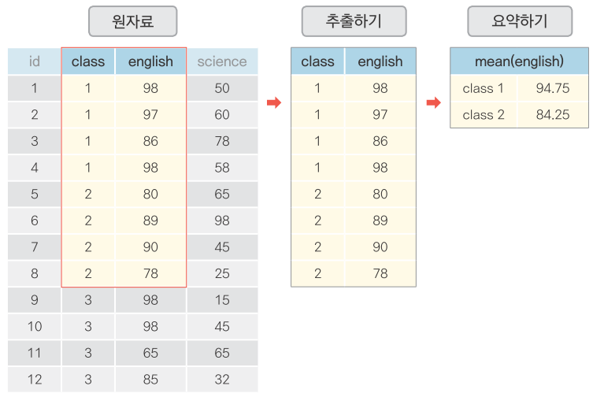
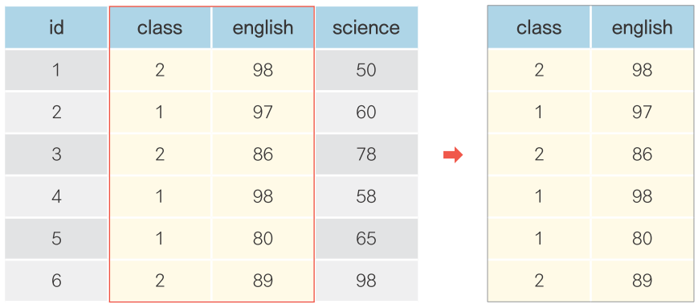
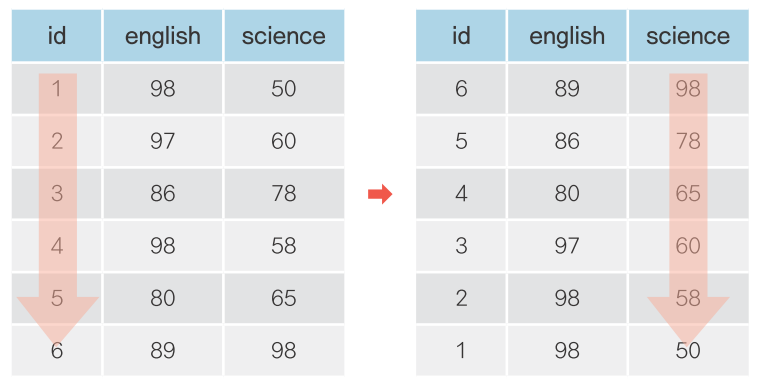
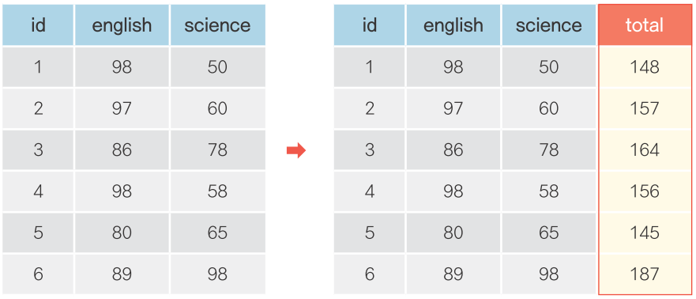
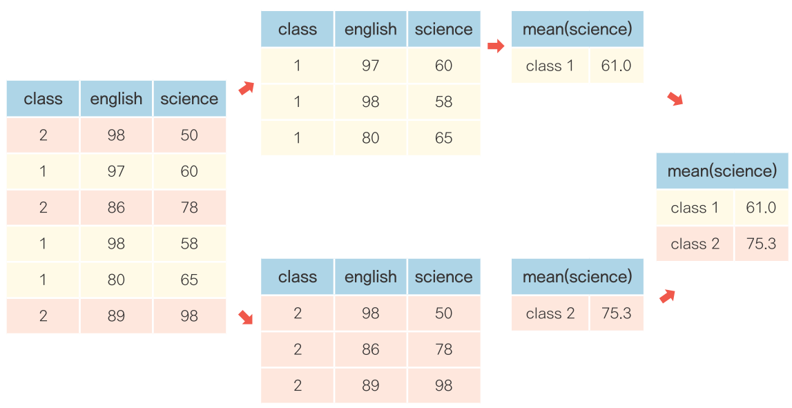
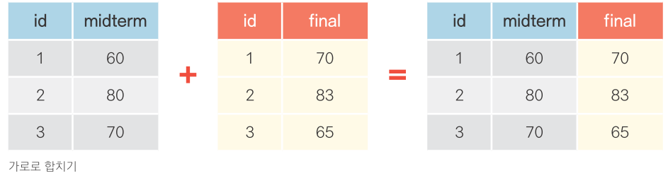
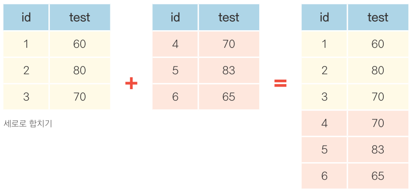

---
output:
  word_document: default
  html_document: default
---
<!-- RMD 설정 -->
```{r, include=F}
Sys.setenv("LANGUAGE"="EN")
library(dplyr)
library(ggplot2)
```

# 6. 자유자재로 데이터 가공하기



##### NP #####


## 06-1. 데이터 전처리 - 원하는 형태로 데이터 가공하기

#### 데이터 전처리(Preprocessing) - dplyr 패키지

함수       |기능
-----------|-------
filter()   |행 추출
select()   |열(변수) 추출
arrange()  |정렬
mutate()   |변수 추가
summarise()|통계치 산출
group_by() |집단별로 나누기
left_join()|데이터 합치기(열)
bind_rows()|데이터 합치기(행)

##### NP

## 06-2. 조건에 맞는 데이터만 추출하기


##### NP #####

### 조건에 맞는 데이터만 추출하기

#### dplyr 패키지 로드 & 데이터 준비

```{r}
library(dplyr)
exam <- read.csv("csv_exam.csv")
exam
```

##### NP #####

```{r}
# exam에서 class가 1인 경우만 추출하여 출력
exam %>% filter(class == 1)
```

> [참고] 단축키 [Ctrl+Shit+M]으로 %>% 기호 입력

##### NP

```{r}
# 2반인 경우만 추출
exam %>% filter(class == 2)
```

##### NP

```{r}
# 1반이 아닌 경우
exam %>% filter(class != 1)
```

##### NP

```{r}
# 3반이 아닌 경우
exam %>% filter(class != 3)
```

##### NP

### 초과, 미만, 이상, 이하 조건 걸기

```{r}
# 수학 점수가 50점을 초과한 경우
exam %>% filter(math > 50)
```

##### NP

```{r}
# 수학 점수가 50점 미만인 경우
exam %>% filter(math < 50)
```

##### NP

```{r}
# 영어점수가 80점 이상인 경우
exam %>% filter(english >= 80)
```

##### NP

```{r}
# 영어점수가 80점 이하인 경우
exam %>% filter(english <= 80)
```


##### NP

### 여러 조건을 충족하는 행 추출하기

```{r}
# 1반 이면서 수학 점수가 50점 이상인 경우
exam %>% filter(class == 1 & math >= 50)
```

##### NP

```{r}
# 2반 이면서 영어점수가 80점 이상인 경우
exam %>% filter(class == 2 & english >= 80)
```

##### NP

### 여러 조건 중 하나 이상 충족하는 행 추출하기

```{r}
# 수학 점수가 90점 이상이거나 영어점수가 90점 이상인 경우
exam %>% filter(math >= 90 | english >= 90)
```

##### NP

```{r}
# 영어점수가 90점 미만이거나 과학점수가 50점 미만인 경우
exam %>% filter(english < 90 | science < 50)
```

##### NP

### 목록에 해당되는 행 추출하기

```{r}
exam %>% filter(class == 1 | class == 3 | class == 5)  # 1, 3, 5 반에 해당되면 추출
```

##### NP

#### %in% 기호 이용하기

```{r}
exam %>% filter(class %in% c(1,3,5))  # 1, 3, 5 반에 해당하면 추출
```

##### NP

### 추출한 행으로 데이터 만들기

```{r}
class1 <- exam %>% filter(class == 1)  # class가 1인 행 추출, class1에 할당
class2 <- exam %>% filter(class == 2)  # class가 2인 행 추출, class2에 할당

mean(class1$math)                      # 1반 수학 점수 평균 구하기
mean(class2$math)                      # 2반 수학 점수 평균 구하기
```

##### NP #####

### R에서 사용하는 기호들

논리 연산자  |기능
:-----------:|---
<            | 작다
<=           | 작거나 같다
>            | 크다
>=           | 크거나 같다
==           | 같다
!=           | 같지 않다
│            | 또는
&            | 그리고
%in%         | 매칭 확인

##### NP

### R에서 사용하는 기호들

산술 연산자|기능
:---------:|---
+          | 더하기
-          | 빼기
*          | 곱하기
/          | 나누기
^ , **     | 제곱
%/%        | 나눗셈의 몫
%%         | 나눗셈의 나머지


##### NP

### 혼자서 해보기

`mpg` 데이터를 이용해 분석 문제를 해결해 보세요.

- Q1. 자동차 배기량에 따라 고속도로 연비가 다른지 알아보려고 합니다. `displ`(배기량)이 `4` 이하인 자동차와 `5` 이상인 자동차 중 어떤 자동차의 `hwy`(고속도로 연비)가 평균적으로 더 높은지 알아보세요.

- Q2. 자동차 제조 회사에 따라 도시 연비가 다른지 알아보려고 합니다. `"audi"`와 `"toyota"` 중 어느 `manufacturer`(자동차 제조 회사)의 `cty`(도시 연비)가 평균적으로 더 높은지 알아보세요.

- Q3. `"chevrolet"`, `"ford"`, `"honda"` 자동차의 고속도로 연비 평균을 알아보려고 합니다. 이 회사들의 자동차를 추출한 뒤 `hwy` 전체 평균을 구해보세요.

##### NP #####

#### 힌트


Q1. 특정 조건에 해당하는 데이터를 추출해서 평균을 구하면 해결할 수 있는 문제입니다. `filter()`를 이용해 `displ` 변수가 특정 값을 지닌 행을 추출해 새로운 변수에 할당한 다음 평균을 구해보세요.

Q2. 앞 문제와 동일한 절차로 해결하면 됩니다. 단, 변수의 값이 숫자가 아니라 문자라는 점이 다릅니다.

Q3. '여러 조건 중 하나 이상 충족'하면 추출하도록 `filter()` 함수를 구성해보세요. 이렇게 추출한 데이터로 평균을 구하면 됩니다. `%in%`를 이용하면 코드를 짧게 만들 수 있습니다.

##### NP

### 정답

Q1. 자동차 배기량에 따라 고속도로 연비가 다른지 알아보려고 합니다. `displ`(배기량)이 `4` 이하인 자동차와 `5` 이상인 자동차 중 어떤 자동차의 `hwy`(고속도로 연비)가 평균적으로 더 높은지 알아보세요.

```{r}
mpg <- as.data.frame(ggplot2::mpg)   # mpg 데이터 불러오기

mpg_a <- mpg %>% filter(displ <= 4)  # displ 4 이하 추출
mpg_b <- mpg %>% filter(displ >= 5)  # displ 5 이상 추출

mean(mpg_a$hwy)  # displ 4 이하 hwy 평균
mean(mpg_b$hwy)  # displ 5 이상 hwy 평균
```

##### NP #####

Q2. 자동차 제조 회사에 따라 도시 연비가 다른지 알아보려고 합니다. `"audi"`와 `"toyota"` 중 어느 `manufacturer`(자동차 제조 회사)의 `cty`(도시 연비)가 평균적으로 더 높은지 알아보세요.

```{r}
mpg_audi <- mpg %>% filter(manufacturer == "audi")      # audi 추출
mpg_toyota <- mpg %>% filter(manufacturer == "toyota")  # toyota 추출

mean(mpg_audi$cty)    # audi의 cty 평균
mean(mpg_toyota$cty)  # toyota의 cty 평균
```

##### NP #####

Q3. `"chevrolet"`, `"ford"`, `"honda"` 자동차의 고속도로 연비 평균을 알아보려고 합니다. 이 회사들의 자동차를 추출한 뒤 `hwy` 전체 평균을 구해보세요.

```{r}
# manufacturer가 chevrolet, ford, honda에 해당하면 추출
mpg_new <- mpg %>% filter(manufacturer %in% c("chevrolet", "ford", "honda"))
mean(mpg_new$hwy)
```

##### NP #####

### 06-3. 필요한 변수만 추출하기



##### NP #####

```{r}
exam %>% select(math)  # math 추출
```

##### NP

```{r}
exam %>% select(english)  # english 추출
```

##### NP

#### 여러 변수 추출하기

```{r}
exam %>% select(class, math, english)  # class, math, english 변수 추출
```

##### NP

#### 변수 제외하기

```{r}
exam %>% select(-math)  # math 제외
```

##### NP

```{r}
exam %>% select(-math, -english)  # math, english 제외
```

##### NP

### dplyr 함수 조합하기

```{r}
# class가 1인 행만 추출한 다음 english 추출
exam %>% filter(class == 1) %>% select(english)
```

##### NP

#### 가독성 있게 줄 바꾸기
```{r, eval=F}
exam %>%
  filter(class == 1) %>%  # class가 1인 행 추출
  select(english)         # english 추출
```

##### NP

#### 일부만 출력하기

```{r}
exam %>%
  select(id, math) %>%  # id, math 추출
  head                  # 앞부분 6행까지 추출
```

##### NP

#### 일부만 출력하기

```{r}
exam %>%
  select(id, math) %>%  # id, math 추출
  head(10)              # 앞부분 10행까지 추출
```

##### NP #####

### 혼자서 해보기

`mpg` 데이터를 이용해서 분석 문제를 해결해보세요.

- Q1. `mpg` 데이터는 11개 변수로 구성되어 있습니다. 이 중 일부만 추출해서 분석에 활용하려고 합니다. `mpg` 데이터에서 `class`(자동차 종류), `cty`(도시 연비) 변수를 추출해 새로운 데이터를 만드세요. 새로 만든 데이터의 일부를 출력해서 두 변수로만 구성되어 있는지 확인하세요.

- Q2. 자동차 종류에 따라 도시 연비가 다른지 알아보려고 합니다. 앞에서 추출한 데이터를 이용해서 `class`(자동차 종류)가 `"suv"`인 자동차와 `"compact"`인 자동차 중 어떤 자동차의 `cty`(도시 연비)가 더 높은지 알아보세요.

##### NP #####

#### 힌트

Q1. `select()`로 변수를 추출해서 새로운 데이터를 만들어 보세요.

Q2. `filter()`로 조건에 해당하는 데이터를 추출한 뒤 평균을 구하면 해결할 수 있습니다.

##### NP #####

### 정답

Q1. `mpg` 데이터는 11개 변수로 구성되어 있습니다. 이 중 일부만 추출해서 분석에 활용하려고 합니다. `mpg` 데이터에서 `class`(자동차 종류), `cty`(도시 연비) 변수를 추출해 새로운 데이터를 만드세요. 새로 만든 데이터의 일부를 출력해서 두 변수로만 구성되어 있는지 확인하세요.

```{r}
mpg <- as.data.frame(ggplot2::mpg)  # mpg 데이터 불러오기

df <- mpg %>% select(class, cty)    # class, cty 변수 추출
head(df)                            # df 일부 출력

```

##### NP #####

Q2. 자동차 종류에 따라 도시 연비가 다른지 알아보려고 합니다. 앞에서 추출한 데이터를 이용해서 `class`(자동차 종류)가 `"suv"`인 자동차와 `"compact"`인 자동차 중 어떤 자동차의 `cty`(도시 연비)가 더 높은지 알아보세요.
```{r}
df_suv <- df %>% filter(class == "suv")          # class가 suv인 행 추출
df_compact <- df %>% filter(class == "compact")  # class가 compact인 행 추출

mean(df_suv$cty)                                 # suv의 cty 평균
mean(df_compact$cty)                             # compact의 cty 평균
```

##### NP #####

## 06-4. 순서대로 정렬하기



##### NP #####

### 오름차순으로 정렬하기

```{r}
exam %>% arrange(math)  # math 오름차순 정렬
```

##### NP

### 내림차순으로 정렬하기

```{r}
exam %>% arrange(desc(math))  # math 내림차순 정렬
```

##### NP

#### 정렬 기준 변수 여러개 지정

```{r}
exam %>% arrange(class, math)  # class 및 math 오름차순 정렬
```

##### NP

### 혼자서 해보기

`mpg` 데이터를 이용해서 분석 문제를 해결해보세요.

- `"audi"`에서 생산한 자동차 중에 어떤 자동차 모델의 `hwy`(고속도로 연비)가 높은지 알아보려고 합니다. `"audi"`에서 생산한 자동차 중 `hwy`가 1~5위에 해당하는 자동차의 데이터를 출력하세요.

##### NP #####

#### 힌트


`filter()`를 이용해 `"audi"`에서 생산한 자동차만 추출하고, `arrange()`로 `hwy`를 내림차순 정렬하면 됩니다. `head()`를 이용하면 이 중 특정 순위에 해당하는 자동차만 출력할 수 있습니다.

##### NP

#### 정답
```{r}
mpg <- as.data.frame(ggplot2::mpg)          # mpg 데이터 불러오기

mpg %>% filter(manufacturer == "audi") %>%  # audi 추출
  arrange(desc(hwy)) %>%                    # hwy 내림차순 정렬
  head(5)                                   # 5행까지 출력
```


##### NP #####

## 06-5. 파생변수 추가하기



##### NP #####

```{r}
exam %>%
  mutate(total = math + english + science) %>%  # 총합 변수 추가
  head                                          # 일부 추출
```

##### NP

#### 여러 파생변수 한 번에 추가하기
```{r}
exam %>%
  mutate(total = math + english + science,          # 총합 변수 추가
         mean = (math + english + science)/3) %>%   # 총평균 변수 추가
  head                                              # 일부 추출
```

##### NP

#### `mutate()`에 `ifelse()` 적용하기
```{r}
exam %>%
  mutate(test = ifelse(science >= 60, "pass", "fail")) %>%
  head
```

##### NP

#### 추가한 변수를 `dplyr` 코드에 바로 활용하기
```{r}
exam %>%
  mutate(total = math + english + science) %>%  # 총합 변수 추가
  arrange(total) %>%                            # 총합 변수 기준 정렬
  head                                          # 일부 추출
```

##### NP

### 혼자서 해보기

`mpg` 데이터를 이용해서 분석 문제를 해결해보세요.
 
`mpg` 데이터는 연비를 나타내는 변수가 `hwy`(고속도로 연비), `cty`(도시 연비) 두 종류로 분리되어 있습니다. 두 변수를 각각 활용하는 대신 하나의 통합 연비 변수를 만들어 분석하려고 합니다.

- Q1. `mpg` 데이터 복사본을 만들고, `cty`와 `hwy`를 더한 '합산 연비 변수'를 추가하세요.

- Q2. 앞에서 만든 '합산 연비 변수'를 2로 나눠 '평균 연비 변수'를 추가세요.

- Q3. '평균 연비 변수'가 가장 높은 자동차 3종의 데이터를 출력하세요.

- Q4. 1~3번 문제를 해결할 수 있는 하나로 연결된 `dplyr` 구문을 만들어 출력하세요. 데이터는 복사본 대신 `mpg` 원본을 이용하세요.

##### NP #####

#### 힌트


Q1. `mutate()`를 적용한 결과를 `<-`를 이용해 데이터 프레임에 할당하는 형태로 코드를 작성하면 기존 데이터 프레임에 변수가 추가됩니다. 

Q3. `arrange()`와 `head()`를 조합하면 됩니다.

Q4. 앞에서 만든 코드들을 `%>%`를 이용해 연결하면 됩니다. 변수를 추가하는 작업을 하나의 `mutate()` 구성하면 코드를 더 간결하게 만들 수 있습니다.


##### NP #####

### 정답

Q1. `mpg` 데이터 복사본을 만들고, `cty`와 `hwy`를 더한 '합산 연비 변수'를 추가하세요.
```{r}
mpg <- as.data.frame(ggplot2::mpg)                # mpg 데이터 불러오기
mpg_new <- mpg                                    # 복사본 만들기

mpg_new <- mpg_new %>% mutate(total = cty + hwy)  # 합산 변수 만들기
```

##### NP #####

Q2. 앞에서 만든 '합산 연비 변수'를 2로 나눠 '평균 연비 변수'를 추가세요.
```{r}
mpg_new <- mpg_new %>% mutate(mean = total/2)     # 평균 변수 만들기
```

##### NP #####

Q3. '평균 연비 변수'가 가장 높은 자동차 3종의 데이터를 출력하세요.
```{r}
mpg_new %>%
  arrange(desc(mean)) %>%  # 내림차순 정렬
  head(3)                  # 상위 3행 출력
```

##### NP #####

Q4. 1~3번 문제를 해결할 수 있는 하나로 연결된 `dplyr` 구문을 만들어 출력하세요. 데이터는 복사본 대신 `mpg` 원본을 이용하세요.
```{r}
mpg %>%
  mutate(total = cty + hwy,   # 합산 변수 만들기
         mean = total/2) %>%  # 평균 변수 만들기
  arrange(desc(mean)) %>%     # 내림차순 정렬
  head(3)                     # 상위 3행 출력
```


##### NP #####

## 06-6. 집단별로 요약하기



##### NP #####

### 집단별로 요약하기

#### 요약하기
```{r}
exam %>% summarise(mean_math = mean(math))  # math 평균 산출
```

##### NP

#### 집단별로 요약하기
```{r}
exam %>%
  group_by(class) %>%                # class별로 분리
  summarise(mean_math = mean(math))  # math 평균 산출
```

##### NP

#### 여러 요약통계량 한 번에 산출하기
```{r}
exam %>%
  group_by(class) %>%                   # class별로 분리
  summarise(mean_math = mean(math),     # math 평균
            sum_math = sum(math),       # math 합계
            median_math = median(math), # math 중앙값
            n = n())                    # 학생 수
```

##### NP

#### 자주 사용하는 요약통계량 함수

함수    |의미
--------|-----
mean()  |평균
sd()    |표준편차
sum()   |합계
median()|중앙값
min()   |최솟값
max()   |최댓값
n()     |빈도

##### NP

#### 각 집단별로 다시 집단 나누기
```{r}
mpg %>%
  group_by(manufacturer, drv) %>%      # 회사별, 구방방식별 분리
  summarise(mean_cty = mean(cty)) %>%  # cty 평균 산출
  head(10)                             # 일부 출력
```


##### NP

### dplyr 조합하기

> 문제) 회사별로 "suv" 자동차의 도시 및 고속도로 통합 연비 평균을 구해 내림차순으로 정렬하고, 1~5위까지 출력하기

#### 분석 절차 생각해보기

절차  |기능                |dplyr 함수
:----:|--------------------|---------
1     |회사별로 분리       |group_by()
2     |suv 추출            |filter()
3     |통합 연비 변수 생성 |mutate()
4     |통합 연비 평균 산출 |summarise()
5     |내림차순 정렬       |arrange()
6     |1~5위까지 출력      |head()

##### NP

#### dplyr 조합하기

```{r}
mpg %>%
  group_by(manufacturer) %>%           # 회사별로 분리
  filter(class == "suv") %>%           # suv 추출
  mutate(tot = (cty+hwy)/2) %>%        # 통합 연비 변수 생성
  summarise(mean_tot = mean(tot)) %>%  # 통합 연비 평균 산출
  arrange(desc(mean_tot)) %>%          # 내림차순 정렬
  head(5)                              # 1~5위까지 출력
```

##### NP

### 혼자서 해보기

`mpg` 데이터를 이용해서 분석 문제를 해결해 보세요.

- Q1. `mpg` 데이터의 `class`는 `"suv"`, `"compact"` 등 자동차를 특징에 따라 일곱 종류로 분류한 변수입니다. 어떤 차종의 연비가 높은지 비교해보려고 합니다. `class`별 `cty` 평균을 구해보세요.

- Q2. 앞 문제의 출력 결과는 `class` 값 알파벳 순으로 정렬되어 있습니다. 어떤 차종의 도시 연비가 높은지 쉽게 알아볼 수 있도록 `cty` 평균이 높은 순으로 정렬해 출력하세요.

- Q3. 어떤 회사 자동차의 `hwy`(고속도로 연비)가 가장 높은지 알아보려고 합니다. `hwy` 평균이 가장 높은 회사 세 곳을 출력하세요.

- Q4. 어떤 회사에서 `"compact"`(경차) 차종을 가장 많이 생산하는지 알아보려고 합니다. 각 회사별 `"compact"` 차종 수를 내림차순으로 정렬해 출력하세요.


##### NP #####

#### 힌트


Q1. `group_by()`를 이용해 `class` 별로 나눈 뒤 `summarise()`를 이용해 `cty` 평균을 구하면 됩니다.

Q2. 앞에서 만든 코드를 `%>%`로 연결하고 내림차순으로 정렬하는 코드를 추가하면 됩니다.

Q3. 2번 문제와 같은 절차로 코드를 구성하고, 일부만 출력하도록 `head()`를 추가하면 됩니다.

Q4. `filter()`를 이용해 `"compact"` 차종만 남긴 후 회사별 자동차 수를 구하면 됩니다. 자동차 수는 데이터가 몇 행으로 구성되는지 빈도를 구하면 알 수 있습니다. 빈도는 `n()`을 이용해 구할 수 있습니다.

##### NP

### 정답


Q1. `mpg` 데이터의 `class`는 `"suv"`, `"compact"` 등 자동차를 특징에 따라 일곱 종류로 분류한 변수입니다. 어떤 차종의 연비가 높은지 비교해보려고 합니다. `class`별 `cty` 평균을 구해보세요.
```{r}
mpg <- as.data.frame(ggplot2::mpg)  # mpg 데이터 불러오기

mpg %>%
  group_by(class) %>%               # class별 분리
  summarise(mean_cty = mean(cty))   # cty 평균 구하기
```

##### NP #####

Q2. 앞 문제의 출력 결과는 `class` 값 알파벳 순으로 정렬되어 있습니다. 어떤 차종의 도시 연비가 높은지 쉽게 알아볼 수 있도록 `cty` 평균이 높은 순으로 정렬해 출력하세요.
```{r}
mpg %>%
  group_by(class) %>%                  # class별 분리
  summarise(mean_cty = mean(cty)) %>%  # cty 평균 구하기
  arrange(desc(mean_cty))              # 내림차순 정렬하기
```

##### NP #####

Q3. 어떤 회사 자동차의 `hwy`(고속도로 연비)가 가장 높은지 알아보려고 합니다. `hwy` 평균이 가장 높은 회사 세 곳을 출력하세요.
```{r}
mpg %>%
  group_by(manufacturer) %>%           # manufacturer별 분리
  summarise(mean_hwy = mean(hwy)) %>%  # hwy 평균 구하기
  arrange(desc(mean_hwy)) %>%          # 내림차순 정렬하기
  head(3)                              # 상위 3행 출력
```

##### NP #####

Q4. 어떤 회사에서 `"compact"`(경차) 차종을 가장 많이 생산하는지 알아보려고 합니다. 각 회사별 `"compact"` 차종 수를 내림차순으로 정렬해 출력하세요.
```{r}
mpg %>%
  filter(class == "compact") %>%  # compact 추출
  group_by(manufacturer) %>%      # manufacturer별 분리
  summarise(count = n()) %>%      # 빈도 구하기
  arrange(desc(count))            # 내림차순 정렬
```

##### NP


## 06-7. 데이터 합치기

#### 가로로 합치기



#### 세로로 합치기



##### NP

### 가로로 합치기

#### 데이터 생성
```{r}
# 중간고사 데이터 생성
test1 <- data.frame(id = c(1, 2, 3, 4, 5),
                    midterm = c(60, 80, 70, 90, 85))

# 기말고사 데이터 생성
test2 <- data.frame(id = c(1, 2, 3, 4, 5),
                    final = c(70, 83, 65, 95, 80))

```

##### NP

```{r}
test1  # test1 출력
test2  # test2 출력
```

##### NP

#### id 기준으로 합치기
```{r}
total <- left_join(test1, test2, by = "id")  # id 기준으로 합쳐 total에 할당
total                                        # total 출력
```

> [주의] by에 변수명을 지정할 때 변수명 앞 뒤에 겹따옴표 입력

##### NP

### 다른 데이터 활용해 변수 추가하기

#### 반별 담임교사 명단 생성
```{r}
name <- data.frame(class = c(1, 2, 3, 4, 5),
                           teacher = c("kim", "lee", "park", "choi", "jung"))
name
```

##### NP

#### class 기준 합치기
```{r}
exam_new <- left_join(exam, name, by = "class")
exam_new
```

##### NP

### 세로로 합치기

#### 데이터 생성
```{r}
# 학생 1~5번 시험 데이터 생성
group_a <- data.frame(id = c(1, 2, 3, 4, 5),
                      test = c(60, 80, 70, 90, 85))

# 학생 6~10번 시험 데이터 생성
group_b <- data.frame(id = c(6, 7, 8, 9, 10),
                      test = c(70, 83, 65, 95, 80))
```

##### NP

```{r}
group_a  # group_a 출력
group_b  # group_b 출력
```

##### NP

#### 세로로 합치기
```{r}
group_all <- bind_rows(group_a, group_b)  # 데이터 합쳐서 group_all에 할당
group_all                                 # group_all 출력
```

##### NP


### 혼자서 해보기

`mpg` 데이터를 이용해서 분석 문제를 해결해 보세요.

`mpg` 데이터의 `fl` 변수는 자동차에 사용하는 연료(fuel)를 의미합니다. 아래는 자동차 연료별 가격을 나타낸 표입니다.

fl  |연료 종류  |가격(갤런당 USD)
:--:|:---------:|:---:
c   |CNG        |2.35
d   |diesel     |2.38
e   |ethanol E85|2.11
p   |premium    |2.76
r   |regular    |2.22

우선 이 정보를 이용해서 연료와 가격으로 구성된 데이터 프레임을 만들어 보세요.

```{r}
fuel <- data.frame(fl = c("c", "d", "e", "p", "r"),
                   price_fl = c(2.35, 2.38, 2.11, 2.76, 2.22),
                   stringsAsFactors = F)
fuel  # 출력
```

- Q1. `mpg` 데이터에는 연료 종류를 나타낸 `fl` 변수는 있지만 연료 가격을 나타낸 변수는 없습니다. 위에서 만든 `fuel` 데이터를 이용해서 `mpg` 데이터에 `price_fl`(연료 가격) 변수를 추가하세요.

- Q2. 연료 가격 변수가 잘 추가됐는지 확인하기 위해서 `model`, `fl`, `price_fl` 변수를 추출해 앞부분 5행을 출력해 보세요.


##### NP #####

#### 힌트


Q1. `left_join()`을 이용해서 `mpg` 데이터에 `fuel` 데이터를 합치면 됩니다. 두 데이터에 공통으로 들어있는 변수를 기준으로 삼아야 합니다.

Q2. `select()`와 `head()`를 조합하면 됩니다.


##### NP #####

### 정답

Q1. `mpg` 데이터에는 연료 종류를 나타낸 `fl` 변수는 있지만 연료 가격을 나타낸 변수는 없습니다. 위에서 만든 `fuel` 데이터를 이용해서 `mpg` 데이터에 `price_fl`(연료 가격) 변수를 추가하세요.
```{r}
mpg <- as.data.frame(ggplot2::mpg)      # mpg 데이터 불러오기
mpg <- left_join(mpg, fuel, by = "fl")  # mpg에 연료 가격 변수 추가
```

##### NP #####

Q2. 연료 가격 변수가 잘 추가됐는지 확인하기 위해서 `model`, `fl`, `price_fl` 변수를 추출해 앞부분 5행을 출력해 보세요.
```{r}
mpg %>%
  select(model, fl, price_fl) %>%       # model, fl, price_fl 추출
  head(5)     
```

##### NP #####

### 정리하기

```{r, eval=F}
# 1.조건에 맞는 데이터만 추출하기
exam %>% filter(english >= 80)

# 여러 조건 동시 충족
exam %>% filter(class == 1 & math >= 50)

# 여러 조건 중 하나 이상 충족
exam %>% filter(math >= 90 | english >= 90)
exam %>% filter(class %in% c(1,3,5))


# 2.필요한 변수만 추출하기
exam %>% select(math)
exam %>% select(class, math, english)


# 3.함수 조합하기, 일부만 출력하기
exam %>%
  select(id, math) %>%
  head(10)

```

##### NP #####

```{r, eval=F}
# 4.순서대로 정렬하기
exam %>% arrange(math)         # 오름차순 정렬
exam %>% arrange(desc(math))   # 내림차순 정렬
exam %>% arrange(class, math)  # 여러 변수 기준 오름차순 정렬

# 5.파생변수 추가하기
exam %>% mutate(total = math + english + science)

# 여러 파생변수 한 번에 추가하기
exam %>%
  mutate(total = math + english + science,
         mean = (math + english + science)/3)

# mutate()에 ifelse() 적용하기
exam %>% mutate(test = ifelse(science >= 60, "pass", "fail"))

# 추가한 변수를 dplyr 코드에 바로 활용하기
exam %>%
  mutate(total = math + english + science) %>%
  arrange(total)
```

##### NP #####

```{r, eval=F}
# 6.집단별로 요약하기
exam %>%
  group_by(class) %>%
  summarise(mean_math = mean(math))

# 각 집단별로 다시 집단 나누기
mpg %>%
  group_by(manufacturer, drv) %>%
  summarise(mean_cty = mean(cty))


# 7.데이터 합치기
# 가로로 합치기
total <- left_join(test1, test2, by = "id")

# 세로로 합치기
group_all <- bind_rows(group_a, group_b)
```


##### NP #####

### 분석 도전

미국 동북중부 437개 지역의 인구통계 정보를 담고 있는 `midwest` 데이터를 사용해 데이터 분석 문제를 해결해 보세요. `midwest`는 `ggplot2` 패키지에 들어 있습니다.

- 문제1. `popadults`는 해당 지역의 성인 인구, `poptotal`은 전체 인구를 나타냅니다. `midwest` 데이터에 '전체 인구 대비 미성년 인구 백분율' 변수를 추가하세요.

- 문제2. 미성년 인구 백분율이 가장 높은 상위 5개 `county`(지역)의 미성년 인구 백분율을 출력하세요.

- 문제3. 분류표의 기준에 따라 미성년 비율 등급 변수를 추가하고, 각 등급에 몇 개의 지역이 있는지 알아보세요.

분류  |기준
------|----
large |40% 이상
middle|30% ~ 40% 미만
small |30% 미만

- 문제4. `popasian`은 해당 지역의 아시아인 인구를 나타냅니다. '전체 인구 대비 아시아인 인구 백분율' 변수를 추가하고, 하위 10개 지역의 `state`(주), `county`(지역명), 아시아인 인구 백분율을 출력하세요.

##### NP #####

### 정답

문제1. `popadults`는 해당 지역의 성인 인구, `poptotal`은 전체 인구를 나타냅니다. `midwest` 데이터에 '전체 인구 대비 미성년 인구 백분율' 변수를 추가하세요.
```{r}
# midwest 불러오기
midwest <- as.data.frame(ggplot2::midwest)

# midwest에 백분율 변수 추가
midwest <- midwest %>%
  mutate(ratio_child = (poptotal-popadults)/poptotal*100)
```

##### NP #####

문제2. 미성년 인구 백분율이 가장 높은 상위 5개 `county`(지역)의 미성년 인구 백분율을 출력하세요.
```{r}
midwest %>%
  arrange(desc(ratio_child)) %>%   # ratio_child 내림차순 정렬
  select(county, ratio_child) %>%  # county, ratio_child 추출
  head(5)                          # 상위 5행 출력
```

##### NP #####

문제3. 분류표의 기준에 따라 미성년 비율 등급 변수를 추가하고, 각 등급에 몇 개의 지역이 있는지 알아보세요.
```{r}
# midwest에 grade 변수 추가
midwest <- midwest %>%
  mutate(grade = ifelse(ratio_child >= 40, "large",
                        ifelse(ratio_child >= 30, "middle", "small")))
  
# 미성년 비율 등급 빈도표
table(midwest$grade)  
```

##### NP #####

문제4. `popasian`은 해당 지역의 아시아인 인구를 나타냅니다. '전체 인구 대비 아시아인 인구 백분율' 변수를 추가하고, 하위 10개 지역의 `state`(주), `county`(지역명), 아시아인 인구 백분율을 출력하세요.
```{r}
midwest %>%
  mutate(ratio_asian = (popasian/poptotal)*100) %>%  # 백분율 변수 추가
  arrange(ratio_asian) %>%                           # 내림차순 정렬
  select(state, county, ratio_asian) %>%             # 변수 추출
  head(10)                                           # 상위 10행 출력 
```
