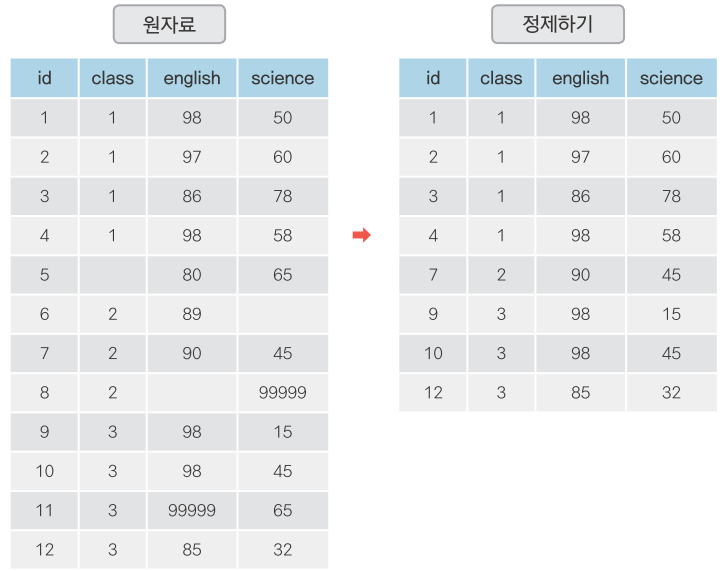
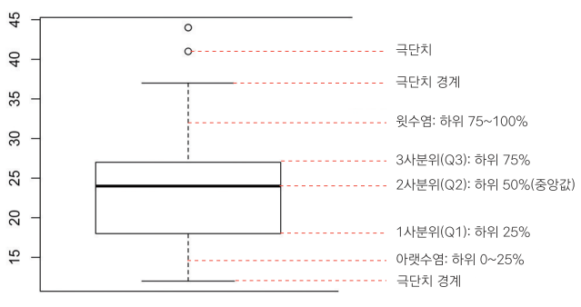
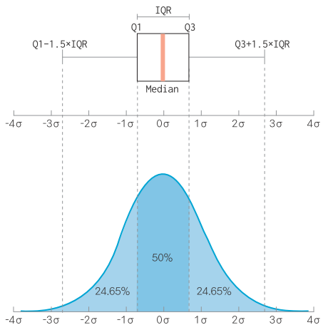

---
output:
  word_document: default
  html_document: default
---

<!-- RMD 설정 -->
```{r, include=F}
Sys.setenv("LANGUAGE"="EN")
library(dplyr)
library(ggplot2)
```

# 7. 데이터 정제

## 빠진 데이터, 이상한 데이터 제거하기



##### NP #####

## 07-1. 빠진 데이터를 찾아라! - 결측치 정제하기

#### 결측치(Missing Value)

- 누락된 값, 비어있는 값
- 함수 적용 불가, 분석 결과 왜곡
- 제거 후 분석 실시

##### NP

### 결측치 찾기

#### 결측치 만들기

- 결측치 표기 - 대문자 `NA`
```{r}
df <- data.frame(sex = c("M", "F", NA, "M", "F"),
                 score = c(5, 4, 3, 4, NA))
df
```
> [유의] NA 앞 뒤에 겹따옴표 없음

##### NP

#### 결측치 확인하기
```{r}
is.na(df)         # 결측치 확인
table(is.na(df))  # 결측치 빈도 출력
```

##### NP

#### 변수별로 결측치 확인하기
```{r}
table(is.na(df$sex))    # sex 결측치 빈도 출력
table(is.na(df$score))  # score 결측치 빈도 출력
```

##### NP

#### 결측치 포함된 상태로 분석
```{r}
mean(df$score)  # 평균 산출
sum(df$score)   # 합계 산출
```

##### NP

### 결측치 제거하기

#### 결측치 있는 행 제거하기
```{r, message=F}
library(dplyr) # dplyr 패키지 로드
df %>% filter(is.na(score))   # score가 NA인 데이터만 출력
df %>% filter(!is.na(score))  # score 결측치 제거
```

##### NP

#### 결측치 제외한 데이터로 분석하기
```{r}
df_nomiss <- df %>% filter(!is.na(score))  # score 결측치 제거
mean(df_nomiss$score)                      # score 평균 산출
sum(df_nomiss$score)                       # score 합계 산출
```

##### NP

#### 여러 변수 동시에 결측치 없는 데이터 추출하기
```{r}
# score, sex 결측치 제외
df_nomiss <- df %>% filter(!is.na(score) & !is.na(sex))
df_nomiss  
```

##### NP


#### 결측치가 하나라도 있으면 제거하기
```{r}
df_nomiss2 <- na.omit(df)  # 모든 변수에 결측치 없는 데이터 추출
df_nomiss2                 # 출력
```

- 분석에 필요한 데이터까지 손실 될 가능성 유의
- ex) 성별-소득 관계 분석하는데 지역 결측치까지 제거


##### NP

### 함수의 결측치 제외 기능 이용하기 - `na.rm = T`
```{r}
mean(df$score, na.rm = T)  # 결측치 제외하고 평균 산출
sum(df$score, na.rm = T)   # 결측치 제외하고 합계 산출
```

##### NP

#### summarise()에서 `na.rm = T`사용하기
- 결측치 생성
```{r}
exam <- read.csv("csv_exam.csv")            # 데이터 불러오기
exam[c(3, 8, 15), "math"] <- NA             # 3, 8, 15행의 math에 NA 할당
```

- 평균 구하기
```{r}
exam %>% summarise(mean_math = mean(math))             # 평균 산출
exam %>% summarise(mean_math = mean(math, na.rm = T))  # 결측치 제외하고 평균 산출
```

##### NP

#### 다른 함수들에 적용
```{r}
exam %>% summarise(mean_math = mean(math, na.rm = T),      # 평균 산출
                   sum_math = sum(math, na.rm = T),        # 합계 산출
                   median_math = median(math, na.rm = T))  # 중앙값 산출
```

##### NP

### 결측치 대체하기
- 결측치 많을 경우 모두 제외하면 데이터 손실 큼
- 대안: 다른 값 채워넣기

#### 결측치 대체법(Imputation)
- 대표값(평균, 최빈값 등)으로 일괄 대체
- 통계분석 기법 적용, 예측값 추정해서 대체

##### NP

### 평균값으로 결측치 대체하기

#### 평균 구하기
```{r}
mean(exam$math, na.rm = T)  # 결측치 제외하고 math 평균 산출
```

##### NP

#### 평균으로 대체하기
```{r}
exam$math <- ifelse(is.na(exam$math), 55, exam$math)  # math가 NA면 55로 대체
table(is.na(exam$math))                               # 결측치 빈도표 생성
```

##### NP

```{r}
exam  # 출력
mean(exam$math)  # math 평균 산출
```

##### NP

### 혼자서 해보기

`mpg` 데이터를 이용해서 분석 문제를 해결해 보세요.

`mpg` 데이터 원본에는 결측치가 없습니다. 우선 `mpg` 데이터를 불러와 몇 개의 값을 결측치로 만들겠습니다. 아래 코드를 실행하면 다섯 행의 `hwy` 변수에 `NA`가 할당됩니다.

```{r}
mpg <- as.data.frame(ggplot2::mpg)           # mpg 데이터 불러오기
mpg[c(65, 124, 131, 153, 212), "hwy"] <- NA  # NA 할당하기
```

##### NP

### 혼자서 해보기

결측치가 들어있는 `mpg` 데이터를 활용해서 문제를 해결해보세요.

- Q1. `drv`(구동방식)별로 `hwy`(고속도로 연비) 평균이 어떻게 다른지 알아보려고 합니다. 분석을 하기 전에 우선 두 변수에 결측치가 있는지 확인해야 합니다. `drv` 변수와 `hwy` 변수에 결측치가 몇 개 있는지 알아보세요.

- Q2. `filter()`를 이용해 `hwy` 변수의 결측치를 제외하고, 어떤 구동방식의 `hwy` 평균이 높은지 알아보세요. 하나의 `dplyr` 구문으로 만들어야 합니다.

##### NP

#### 힌트

Q1. 빈도표를 만드는 `table()`과 결측치를 확인하는 `is.na()`를 조합해 보세요.

Q2. `filter()`와 `is.na()`를 조합해 결측치를 제외하고, 집단별 평균을 구하는 코드를 `%>%`로 연결하면 됩니다.

##### NP 

Q1.`drv`(구동방식)별로 `hwy`(고속도로 연비) 평균이 어떻게 다른지 알아보려고 합니다. 분석을 하기 전에 우선 두 변수에 결측치가 있는지 확인해야 합니다. `drv` 변수와 `hwy` 변수에 결측치가 몇 개 있는지 알아보세요.
```{r}
table(is.na(mpg$drv))  # drv 결측치 빈도표 출력
table(is.na(mpg$hwy))  # hwy 결측치 빈도표 출력
```

##### NP #####

Q2. `filter()`를 이용해 `hwy` 변수의 결측치를 제외하고, 어떤 구동방식의 `hwy` 평균이 높은지 알아보세요. 하나의 `dplyr` 구문으로 만들어야 합니다.
```{r}
mpg %>%
  filter(!is.na(hwy)) %>%          # 결측치 제외
  group_by(drv) %>%                # drv별 분리
  summarise(mean_hwy = mean(hwy))  # hwy 평균 구하기
```


##### NP

## 07-2. 이상한 데이터를 찾아라! - 이상치 정제하기


#### 이상치(Outlier) - 정상범주에서 크게 벗어난 값
- 이상치 포함시 분석 결과 왜곡
- 결측 처리 후 제외하고 분석

이상치 종류      |예                |해결 방법
-----------------|------------------|---------
존재할 수 없는 값|성별 변수에 3     |결측 처리
극단적인 값      |몸무게 변수에 200 |정상범위 기준 정해서 결측 처리

##### NP

### 이상치 제거하기 - 1. 존재할 수 없는 값
- 논리적으로 존재할 수 없으므로 바로 결측 처리 후 분석시 제외

#### 이상치 포함된 데이터 생성 - sex 3, score 6
```{r}
outlier <- data.frame(sex = c(1, 2, 1, 3, 2, 1),
                      score = c(5, 4, 3, 4, 2, 6))
outlier
```

##### NP

#### 이상치 확인하기
```{r}
table(outlier$sex)
table(outlier$score)
```

##### NP

#### 결측 처리하기 - sex
```{r}
# sex가 3이면 NA 할당
outlier$sex <- ifelse(outlier$sex == 3, NA, outlier$sex)
outlier
```

##### NP

#### 결측 처리하기 - score
```{r}
# sex가 1~5 아니면 NA 할당
outlier$score <- ifelse(outlier$score > 5, NA, outlier$score)
outlier
```

##### NP

#### 결측치 제외하고 분석
```{r}
outlier %>%
  filter(!is.na(sex) & !is.na(score)) %>%
  group_by(sex) %>%
  summarise(mean_score = mean(score))
```

##### NP

### 이상치 제거하기 - 2. 극단적인 값
- 정상범위 기준 정해서 벗어나면 결측 처리

판단 기준   |예
------------|---
논리적 판단 |성인 몸무게 40kg~150kg 벗어나면 극단치
통계적 판단 |상하위 0.3% 극단치 또는 상자그림 1.5 IQR 벗어나면 극단치

##### NP

### 상자그림으로 극단치 기준 정해서 제거하기

#### 상자그림 생성
```{r}
mpg <- as.data.frame(ggplot2::mpg)
boxplot(mpg$hwy)
```



##### NP



##### NP

상자 그림          |값                   |설명
------------------ |---------------------|---
상자 아래 세로 점선|아래수염             |하위 0~25% 내에 해당하는 값
상자 밑면          |1사분위수(Q1)        |하위 25% 위치 값
상자 내 굵은 선    |2사분위수(Q2)        |하위 50% 위치 값(중앙값)
상자 윗면          |3사분위수(Q3)        |하위 75% 위치 값
상자 위 세로 점선  |윗수염               |하위 75~100% 내에 해당하는 값
상자 밖 가로선     |극단치 경계          |Q1, Q3 밖 1.5 IQR 내 최대값
상자 밖 점 표식    |극단치               |Q1, Q3 밖 1.5 IQR을 벗어난 값

##### NP

#### 상자그림 통계치 출력
```{r}
boxplot(mpg$hwy)$stats  # 상자그림 통계치 출력
```

##### NP

#### 결측 처리하기
```{r}
# 12~37 벗어나면 NA 할당
mpg$hwy <- ifelse(mpg$hwy < 12 | mpg$hwy > 37, NA, mpg$hwy)
table(is.na(mpg$hwy))
```

##### NP

#### 결측치 제외하고 분석하기
```{r}
mpg %>%
  group_by(drv) %>%
  summarise(mean_hwy = mean(hwy, na.rm = T))
```

##### NP

### 혼자서 해보기

`mpg` 데이터를 이용해서 분석 문제를 해결해 보세요.

우선 `mpg` 데이터를 불러와서 일부러 이상치를 만들겠습니다. `drv`(구동방식) 변수의 값은 `4`(사륜구동), `f`(전륜구동), `r`(후륜구동) 세 종류로 되어있습니다. 몇 개의 행에 존재할 수 없는 값 `k`를 할당하겠습니다. `cty`(도시 연비) 변수도 몇 개의 행에 극단적으로 크거나 작은 값을 할당하겠습니다.

```{r}
mpg <- as.data.frame(ggplot2::mpg)                  # mpg 데이터 불러오기
mpg[c(10, 14, 58, 93), "drv"] <- "k"                # drv 이상치 할당
mpg[c(29, 43, 129, 203), "cty"] <- c(3, 4, 39, 42)  # cty 이상치 할당
```


##### NP

### 혼자서 해보기

이상치가 들어있는 `mpg` 데이터를 활용해서 문제를 해결해보세요.

구동방식별로 도시 연비가 다른지 알아보려고 합니다. 분석을 하려면 우선 두 변수에 이상치가 있는지 확인하려고 합니다.

- Q1. `drv`에 이상치가 있는지 확인하세요. 이상치를 결측 처리한 다음 이상치가 사라졌는지 확인하세요. 결측 처리 할 때는 `%in%` 기호를 활용하세요.

- Q2. 상자 그림을 이용해서 `cty`에 이상치가 있는지 확인하세요. 상자 그림의 통계치를 이용해 정상 범위를 벗어난 값을 결측 처리한 후 다시 상자 그림을 만들어 이상치가 사라졌는지 확인하세요.

- Q3. 두 변수의 이상치를 결측처리 했으니 이제 분석할 차례입니다. 이상치를 제외한 다음 `drv`별로 `cty` 평균이 어떻게 다른지 알아보세요. 하나의 `dplyr` 구문으로 만들어야 합니다.

##### NP

#### 힌트

Q1. `drv`가 정상적인 값이면 원래 값을 유지하고 그렇지 않으면 `NA`를 부여하는 코드를 작성하면 됩니다. 정상적인 값이 여러 개 있으니 `%in%`와 `c()`를 조합해 코드를 간결하게 만들어 보세요.

Q2. 상자 그림을 만들 때 사용하는 다섯 가지 통계치를 출력해 정상 범위의 기준을 찾으세요. 그런 다음 `filter()`를 이용해 `cty`가 이 범위를 벗어날 경우 `NA`를 부여하면 이상치가 결측 처리 됩니다.

Q3. `filter()`를 이용해 `drv`와 `cty`가 모두 결측치가 아닌 데이터를 추출한 후 집단별 평균을 구하면 됩니다.


##### NP

### 정답

Q1. `drv`에 이상치가 있는지 확인하세요. 이상치를 결측 처리한 다음 이상치가 사라졌는지 확인하세요. 결측 처리 할 때는 `%in%` 기호를 활용하세요.
```{r}
# 이상치 확인
table(mpg$drv)

# drv가 4, f, r이면 기존 값 유지, 그 외 NA할당
mpg$drv <- ifelse(mpg$drv %in% c("4", "f", "r"), mpg$drv, NA)

# 이상치 확인
table(mpg$drv)
```

##### NP #####

Q2. 상자 그림을 이용해서 `cty`에 이상치가 있는지 확인하세요. 상자 그림의 통계치를 이용해 정상 범위를 벗어난 값을 결측 처리한 후 다시 상자 그림을 만들어 이상치가 사라졌는지 확인하세요.


<!-- 화면용 -->
```{r, eval=F}
# 상자 그림 생성 및 통계치 산출
boxplot(mpg$cty)$stats
```

<!-- 실행용 -->
```{r, echo=F}
# 상자 그림 생성 및 통계치 산출
boxplot(mpg$cty, plot = F)$stats
```


```{r}
# 9~26 벗어나면 NA 할당
mpg$cty <- ifelse(mpg$cty < 9 | mpg$cty > 26, NA, mpg$cty)

# 상자 그림 생성
boxplot(mpg$cty)
```


##### NP #####

Q3. 두 변수의 이상치를 결측처리 했으니 이제 분석할 차례입니다. 이상치를 제외한 다음 `drv`별로 `cty` 평균이 어떻게 다른지 알아보세요. 하나의 `dplyr` 구문으로 만들어야 합니다.
```{r}
mpg %>%
  filter(!is.na(drv) & !is.na(cty)) %>%  # 결측치 제외
  group_by(drv) %>%                      # drv별 분리
  summarise(mean_hwy = mean(cty))        # cty 평균 구하기
```

##### NP #####

### 정리하기
```{r, eval=F}
# 1.결측치 정제하기

# 결측치 확인
table(is.na(df$score))

# 결측치 제거
df_nomiss <- df %>% filter(!is.na(score))

# 여러 변수 동시에 결측치 제거
df_nomiss <- df %>% filter(!is.na(score) & !is.na(sex))

# 함수의 결측치 제외 기능 이용하기
mean(df$score, na.rm = T)
exam %>% summarise(mean_math = mean(math, na.rm = T))
```

##### NP #####

### 정리하기

```{r, eval=F}
# 2.이상치 정제하기

# 이상치 확인
table(outlier$sex)

# 결측 처리
outlier$sex <- ifelse(outlier$sex == 3, NA, outlier$sex)

# boxplot으로 극단치 기준 찾기
boxplot(mpg$hwy)$stats

# 극단치 결측 처리
mpg$hwy <- ifelse(mpg$hwy < 12 | mpg$hwy > 37, NA, mpg$hwy)
```


