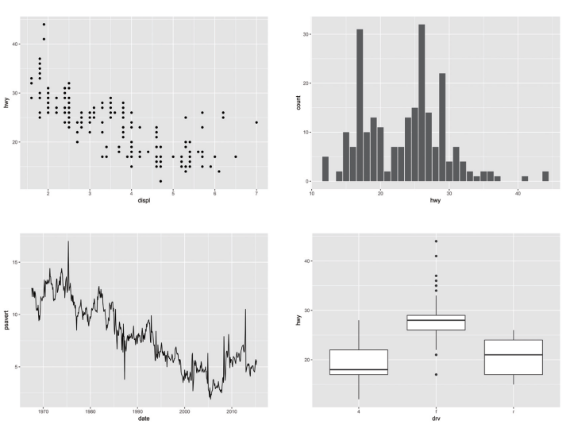
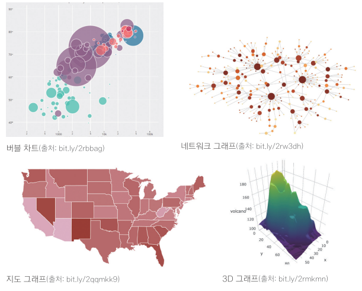
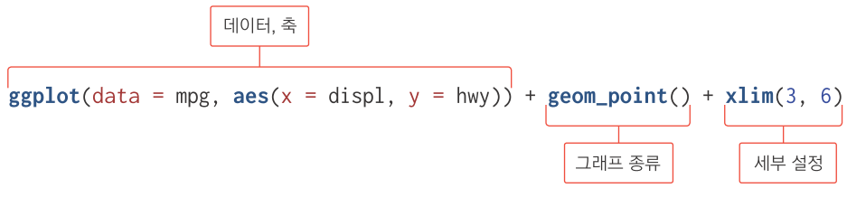

---
output:
  word_document: default
  html_document: default
---

<!-- RMD 설정 -->
```{r, include=F}
Sys.setenv("LANGUAGE"="EN")
library(dplyr)
library(ggplot2)
```

# 08. 그래프 만들기



##### NP #####

## 08-1. R로 만들 수 있는 그래프 살펴보기

- 2차원 그래프, 3차원 그래프
- 지도 그래프
- 네트워크 그래프
- 모션 차트
- 인터랙티브 그래프



##### NP #####

#### 쉽게 그래프를 만들 수 있는 ggplot2 패키지


##### NP #####

## 08-2. 산점도 - 변수 간 관계 표현하기

#### ggplot2 레이어 구조 이해하기


##### NP #####

### 산점도 만들기
- 산점도(Scater Plot) : 데이터를 x축과 y축에 점으로 표현한 그래프
- 나이와 소득처럼, 연속 값으로 된 두 변수의 관계를 표현할 때 사용

#### ggplot2 로드
```{r, warning=F, message=F}
library(ggplot2)
```

##### NP #####

#### 1. 배경 설정하기
```{r}
# x축 displ, y축 hwy로 지정해 배경 생성
ggplot(data = mpg, aes(x = displ, y = hwy))

```

##### NP #####

#### 2. 그래프 추가하기
```{r}
# 배경에 산점도 추가
ggplot(data = mpg, aes(x = displ, y = hwy)) + geom_point()

```

##### NP #####

#### 3. 축 범위를 조정하는 설정 추가하기
```{r, warning=F}
# x축 범위 3~6으로 지정
ggplot(data = mpg, aes(x = displ, y = hwy)) + geom_point() + xlim(3, 6)
```

##### NP #####

#### 3. 축 범위를 조정하는 설정 추가하기
```{r, warning=F}
# x축 범위 3~6, y축 범위 10~30으로 지정
ggplot(data = mpg, aes(x = displ, y = hwy)) + 
  geom_point() + 
  xlim(3, 6) + 
  ylim(10, 30)
```
  
##### NP #####

#### ggplot 함수 구조



##### NP #####

#### ggplot2 코드 가독성 높이기

- 한 줄로 작성
```{r, eval=F}
ggplot(data = mpg, aes(x = displ, y = hwy)) + geom_point() + xlim(3, 6) + ylim(10, 30)
```

- `+` 뒤에서 줄 바꾸기
```{r, eval=F}
ggplot(data = mpg, aes(x = displ, y = hwy)) +
  geom_point() +
  xlim(3, 6) +
  ylim(10, 30)
```

##### NP #####

#### ggplot() vs qplot()

- qplot() : 전처리 단계 데이터 확인용 문법 간단, 기능 단순
- ggplot() : 최종 보고용. 색, 크기, 폰트 등 세부 조작 가능

##### NP #####

### 혼자서 해보기

`mpg` 데이터와 `midwest` 데이터를 이용해서 분석 문제를 해결해 보세요.

- Q1. `mpg` 데이터의 `cty`(도시 연비)와 `hwy`(고속도로 연비) 간에 어떤 관계가 있는지 알아보려고 합니다. x축은 `cty`, y축은 `hwy`로 된 산점도를 만들어 보세요.

- Q2. 미국 지역별 인구통계 정보를 담은 `ggplot2` 패키지의 `midwest` 데이터를 이용해서 전체 인구와 아시아인 인구 간에 어떤 관계가 있는지 알아보려고 합니다. x축은 `poptotal`(전체 인구), y축은 `popasian`(아시아인 인구)으로 된 산점도를 만들어 보세요. 전체 인구는 50만 명 이하, 아시아인 인구는 1만 명 이하인 지역만 산점도에 표시되게 설정하세요.

##### NP

#### 힌트

Q1. `geom_point()`를 이용해 산점도를 만들어 보세요.

Q2. `xlim()`과 `ylim()`을 이용해 조건에 맞게 축을 설정하면 됩니다.

##### NP ##### 

### 정답

Q1. `mpg` 데이터의 `cty`(도시 연비)와 `hwy`(고속도로 연비) 간에 어떤 관계가 있는지 알아보려고 합니다. x축은 `cty`, y축은 `hwy`로 된 산점도를 만들어 보세요.
```{r}
ggplot(data = mpg, aes(x = cty, y = hwy)) + geom_point()
```

##### NP #####
Q2. 미국 지역별 인구통계 정보를 담은 `ggplot2` 패키지의 `midwest` 데이터를 이용해서 전체 인구와 아시아인 인구 간에 어떤 관계가 있는지 알아보려고 합니다. x축은 `poptotal`(전체 인구), y축은 `popasian`(아시아인 인구)으로 된 산점도를 만들어 보세요. 전체 인구는 50만 명 이하, 아시아인 인구는 1만 명 이하인 지역만 산점도에 표시되게 설정하세요.
```{r, warning=F}
ggplot(data = midwest, aes(x = poptotal, y = popasian)) +
  geom_point() +
  xlim(0, 500000) +
  ylim(0, 10000)
```

#### 참고
- 10만 단위가 넘는 숫자는 지수 표기법(Exponential Notation)에 따라 표현됨
- 1e+05 = 10만(1 × 10의 5승)
- 정수로 표현하기 : `options(scipen = 99)` 실행 후 그래프 생성
- 지수로 표현하기 : `options(scipen = 0)`  실행 후 그래프 생성
- R 스튜디오 재실행시 옵션 원상 복구됨

##### NP #####

## 08-3. 막대 그래프 - 집단 간 차이 표현하기

- 막대 그래프(Bar Chart) : 데이터의 크기를 막대의 길이로 표현한 그래프
- 성별 소득 차이처럼 집단 간 차이를 표현할 때 주로 사용

##### NP #####

### 막대 그래프 1 - 평균 막대 그래프 만들기
- 각 집단의 평균값을 막대 길이로 표현한 그래프

#### 1. 집단별 평균표 만들기
```{r, message=F, warning=F}
library(dplyr)

df_mpg <- mpg %>%
  group_by(drv) %>%
  summarise(mean_hwy = mean(hwy))

df_mpg
```

##### NP #####

#### 2. 그래프 생성하기
```{r}
ggplot(data = df_mpg, aes(x = drv, y = mean_hwy)) + geom_col()
```

##### NP #####

#### 3. 크기 순으로 정렬하기
```{r}
ggplot(data = df_mpg, aes(x = reorder(drv, -mean_hwy), y = mean_hwy)) + geom_col()
```

##### NP #####

### 막대 그래프 2 - 빈도 막대 그래프
- 값의 개수(빈도)로 막대의 길이를 표현한 그래프

```{r}
# x축 범주 변수, y축 빈도
ggplot(data = mpg, aes(x = drv)) + geom_bar()
```

##### NP #####

```{r}
# x축 연속 변수, y축 빈도
ggplot(data = mpg, aes(x = hwy)) + geom_bar()
```

##### NP #####

#### geom_col() VS geom_bar()

- 평균 막대 그래프 : 데이터를 요약한 평균표를 먼저 만든 후 평균표를 이용해 그래프 생성 - `geom_col()`

- 빈도 막대 그래프 : 별도로 표를 만들지 않고 원자료를 이용해 바로 그래프 생성 - `geom_bar()`

##### NP #####

### 혼자서 해보기

`mpg` 데이터를 이용해서 분석 문제를 해결해 보세요.

- Q1. 어떤 회사에서 생산한 `"suv"` 차종의 도시 연비가 높은지 알아보려고 합니다. `"suv"` 차종을 대상으로 평균 `cty`(도시 연비)가 가장 높은 회사 다섯 곳을 막대 그래프로 표현해 보세요. 막대는 연비
가 높은 순으로 정렬하세요.

- Q2. 자동차 중에서 어떤 `class`(자동차 종류)가 가장 많은지 알아보려고 합니다. 자동차 종류별 빈도를 표현한 막대 그래프를 만들어 보세요.

##### NP #####

#### 힌트

Q1. 우선 그래프로 나타낼 집단별 평균표를 만들어야합니다. `filter()`로 `"suv"` 차종만 추출한 후 `group_by()`와 `summarise()`로 회사별 `cty` 평균을 구하고, `arrange()`와 `head()`로 상위 5행을 추출하면 됩니다.
이렇게 만든 표를 `geom_col()`을 이용해 막대 그래프로 표현해 보세요. `reorder()`를 이용해 정렬 기준이 되는 평균 연비 변수 앞에 `-` 기호를 붙이면 연비가 높은 순으로 막대를 정렬할 수 있습니다.

Q2. 빈도 막대 그래프는 요약표를 만드는 절차 없이 원자료를 이용해 만들므로 `geom_col()` 대신 `geom_bar()`를 사용하면 됩니다.


##### NP #####

### 정답

Q1. 어떤 회사에서 생산한 `"suv"` 차종의 도시 연비가 높은지 알아보려고 합니다. `"suv"` 차종을 대상으로 평균 `cty`(도시 연비)가 가장 높은 회사 다섯 곳을 막대 그래프로 표현해 보세요. 막대는 연비
가 높은 순으로 정렬하세요.
```{r}
# 평균 표 생성
df <- mpg %>%
  filter(class == "suv") %>%
  group_by(manufacturer) %>%
  summarise(mean_cty = mean(cty)) %>%
  arrange(desc(mean_cty)) %>%
  head(5)

# 그래프 생성
ggplot(data = df, aes(x = reorder(manufacturer, -mean_cty),
                      y = mean_cty)) + geom_col()
```

##### NP #####
Q2. 자동차 중에서 어떤 `class`(자동차 종류)가 가장 많은지 알아보려고 합니다. 자동차 종류별 빈도를 표현한 막대 그래프를 만들어 보세요.
```{r}
ggplot(data = mpg, aes(x = class)) + geom_bar()

```

##### NP #####

## 08-4. 선 그래프 - 시간에 따라 달라지는 데이터 표현하기

- 선 그래프(Line Chart) : 데이터를 선으로 표현한 그래프
- 시계열 그래프(Time Series Chart) : 일정 시간 간격을 두고 나열된 시계열 데이터(Time Series Data)를 선으로 표현한 그래프. 환율, 주가지수 등 경제 지표가 시간에 따라 어떻게 변하는지 표현할 때 활용

##### NP #####

### 시계열 그래프 만들기
```{r}
ggplot(data = economics, aes(x = date, y = unemploy)) + geom_line()
```

##### NP #####

### 혼자서 해보기

`economics` 데이터를 이용해서 분석 문제를 해결해 보세요.

- Q1. `psavert`(개인 저축률)가 시간에 따라서 어떻게 변해왔는지 알아보려고 합니다. 시간에 따른 개인 저축률의 변화를 나타낸 시계열 그래프를 만들어 보세요.

##### NP #####

### 정답

Q1. `psavert`(개인 저축률)가 시간에 따라서 어떻게 변해왔는지 알아보려고 합니다. 시간에 따른 개인 저축률의 변화를 나타낸 시계열 그래프를 만들어 보세요.
```{r, warning=F}
ggplot(data = economics, aes(x = date, y = psavert)) + geom_line()
```

##### NP #####

## 08-5. 상자 그림 - 집단 간 분포 차이 표현하기
- 상자 그림(Box Plot) : 데이터의 분포(퍼져 있는 형태)를 직사각형 상자 모양으로 표현한 그래프
- 분포를 알 수 있기 때문에 평균만 볼 때보다 데이터의 특성을 좀 더  자세히 이해할 수 있음


##### NP #####

### 상자 그림 만들기

```{r}
ggplot(data = mpg, aes(x = drv, y = hwy)) + geom_boxplot()
```

##### NP #####

상자 그림          |값                   |설명
------------------ |---------------------|---
상자 아래 세로선   |아래 수염            |하위 0~25% 내에 해당하는 값
상자 밑면          |1사분위수(Q1)        |하위 25% 위치 값
상자 내 굵은 선    |2사분위수(Q2)        |하위 50% 위치 값(중앙값)
상자 윗면          |3사분위수(Q3)        |하위 75% 위치 값
상자 위 세로선     |윗수염               |하위 75~100% 내에 해당하는 값
상자 밖 점 표식    |극단치               |Q1, Q3 밖 1.5 IQR을 벗어난 값

> [참고] 1.5 IQR: 사분위 범위(Q1~Q3간 거리)의 1.5배

##### NP #####

### 혼자서 해보기

`mpg` 데이터를 이용해서 분석 문제를 해결해 보세요.

- Q1. `class`(자동차 종류)가 `"compact"`, `"subcompact"`, `"suv"`인 자동차의 `cty`(도시 연비)가 어떻게 다른지 비교해보려고 합니다. 세 차종의 `cty`를 나타낸 상자 그림을 만들어보세요.

##### NP

#### 힌트

우선 `filter()`를 이용해 비교할 세 차종을 추출해야 합니다. 추출한 데이터를 이용해 `geom_boxplot()`으로 상자그림을 만들면 됩니다.

##### NP #####

### 정답

Q1. `class`(자동차 종류)가 `"compact"`, `"subcompact"`, `"suv"`인 자동차의 `cty`(도시 연비)가 어떻게 다른지 비교해보려고 합니다. 세 차종의 `cty`를 나타낸 상자 그림을 만들어보세요.

```{r, warning=F}
class_mpg <- mpg %>% 
  filter(class %in% c("compact", "subcompact", "suv"))

ggplot(data = class_mpg, aes(x = class, y = cty)) + geom_boxplot()
```


##### NP #####

#### 앞에서 다룬 ggplot2 함수들
   
값             |내용
---------------|----
geom_point()   | 산점도
geom_col()     | 막대 그래프 - 요약표
geom_bar()     | 막대 그래프 - 원자료
geom_line()    | 선 그래프
geom_boxplot() | 상자 그림

##### NP #####

### 정리하기

```{r, eval=F}
# 1.산점도
ggplot(data = mpg, aes(x = displ, y = hwy)) + geom_point()

# 축 설정 추가
ggplot(data = mpg, aes(x = displ, y = hwy)) +
  geom_point() +
  xlim(3, 6) +
  ylim(10, 30)

# 2.평균 막대 그래프

# 1단계.평균표 만들기
df_mpg <- mpg %>%
  group_by(drv) %>%
  summarise(mean_hwy = mean(hwy))

# 2단계.그래프 생성하기, 크기순 정렬하기
ggplot(data = df_mpg, aes(x = reorder(drv, -mean_hwy), y = mean_hwy)) + geom_col()

# 3.빈도 막대 그래프
ggplot(data = mpg, aes(x = drv)) + geom_bar()
```

### 정리하기

```{r, eval=F}
# 4.선 그래프
ggplot(data = economics, aes(x = date, y = unemploy)) + geom_line()

# 5.상자 그림
ggplot(data = mpg, aes(x = drv, y = hwy)) + geom_boxplot()
```

