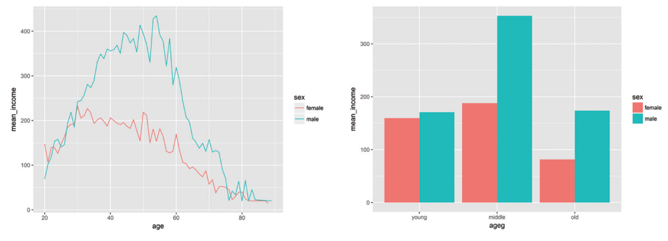
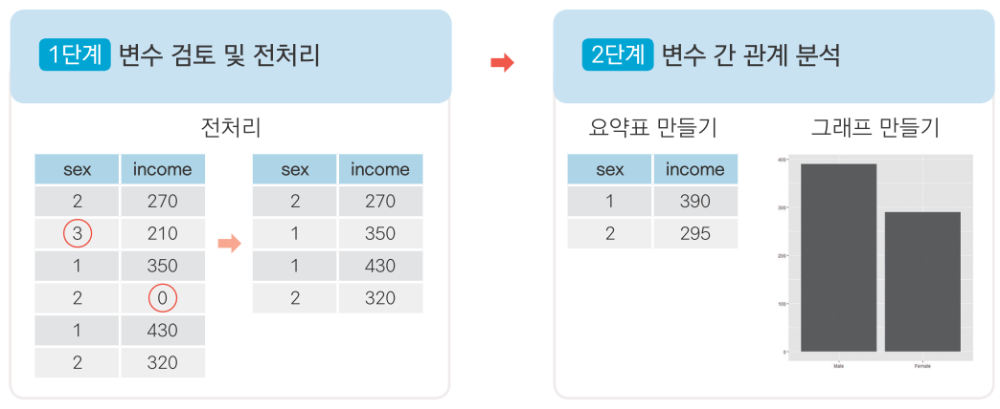

---
output:
  word_document: default
  html_document: default
---

<!-- RMD 설정 -->
```{r, include=F}
Sys.setenv("LANGUAGE"="EN")
library(foreign)             # SPSS 파일 로드
library(dplyr)               # 전처리
library(ggplot2)             # 시각화
library(readxl)              # 엑셀 파일 불러오기
```

# 09. 데이터 분석 프로젝트 

## '한국인의 삶을 파악하라!'



##### NP #####

## 09-1. '한국복지패널데이터' 분석 준비하기

#### 한국복지패널데이터
- 한국보건사회연구원 발간
- 가구의 경제활동을 연구해 정책 지원에 반영할 목적
- 2006~2015년까지 전국에서 7000여 가구를 선정해 매년 추적 조사
- 경제활동, 생활실태, 복지욕구 등 수천 개 변수에 대한 정보로 구성

##### NP #####

### 데이터 분석 준비하기

#### 패키지 준비하기

```{r, eval=F}
install.packages("foreign")  # foreign 패키지 설치
library(foreign)             # SPSS 파일 로드
library(dplyr)               # 전처리
library(ggplot2)             # 시각화
library(readxl)              # 엑셀 파일 불러오기
```

#### 데이터 준비하기

```{r, warning=F}
# 데이터 불러오기
raw_welfare <- read.spss(file = "Koweps_hpc10_2015_beta1.sav",
                         to.data.frame = T)

# 복사본 만들기
welfare <- raw_welfare
```

##### NP #####

#### 데이터 검토하기
```{r, eval=F}
head(welfare)
tail(welfare)
View(welfare)
dim(welfare)
str(welfare)
summary(welfare)
```

- 대규모 데이터는 변수가 많고 변수명이 코드로 되어 있어서 전체 데이터 구조를 한눈에 파악하기 어려움

- 변수명을 쉬운 단어로 바꾼 후 분석에 사용할 변수들 각각 파악해야 함

##### NP #####

#### 변수명 바꾸기
```{r}
welfare <- rename(welfare,
                  sex = h10_g3,            # 성별
                  birth = h10_g4,          # 태어난 연도
                  marriage = h10_g10,      # 혼인 상태
                  religion = h10_g11,      # 종교
                  income = p1002_8aq1,     # 월급
                  code_job = h10_eco9,     # 직종 코드
                  code_region = h10_reg7)  # 지역 코드
```

##### NP #####

#### 데이터 분석 절차
- 1단계. 변수 검토 및 전처리
- 2단계. 변수 간 관계 분석



##### NP #####

## 09-2. 성별에 따른 월급 차이 

## - "성별에 따라 월급이 다를까?"

#### 분석 절차

**1. 변수 검토 및 전처리**

- 성별
- 월급

**2. 변수 간 관계 분석**

- 성별 월급 평균표 만들기
- 그래프 만들기

##### NP #####

### 성별 변수 검토 및 전처리 

#### 1. 변수 검토하기
```{r}
class(welfare$sex)
table(welfare$sex)
```

##### NP #####

#### 2. 전처리
```{r}
# 이상치 확인
table(welfare$sex)

# 이상치 결측 처리
welfare$sex <- ifelse(welfare$sex == 9, NA, welfare$sex)

# 결측치 확인
table(is.na(welfare$sex))

# 성별 항목 이름 부여
welfare$sex <- ifelse(welfare$sex == 1, "male", "female")
table(welfare$sex)
qplot(welfare$sex)
```

##### NP #####

### 월급 변수 검토 및 전처리

#### 1. 변수 검토하기
```{r}
class(welfare$income)
summary(welfare$income)
```

##### NP #####

```{r, warning=F, message=F}
qplot(welfare$income)
```

##### NP #####

```{r, warning=F, message=F}
qplot(welfare$income) + xlim(0, 1000)
```

##### NP #####

#### 2. 전처리
```{r}
# 이상치 확인
summary(welfare$income)

# 이상치 결측 처리
welfare$income <- ifelse(welfare$income %in% c(0, 9999), NA, welfare$income)

# 결측치 확인
table(is.na(welfare$income))
```

##### NP #####

### 성별에 따른 월급 차이 분석하기

#### 1. 성별 월급 평균표 만들기
```{r}
sex_income <- welfare %>%
  filter(!is.na(income)) %>%
  group_by(sex) %>%
  summarise(mean_income = mean(income))

sex_income
```

##### NP #####

#### 2. 그래프 만들기

```{r}
ggplot(data = sex_income, aes(x = sex, y = mean_income)) + geom_col()
```

##### NP #####

## 09-3. 나이와 월급의 관계

## - "몇 살 때 월급을 가장 많이 받을까?"

#### 분석 절차

**1. 변수 검토 및 전처리**
  
- 나이
- 월급

**2. 변수 간 관계 분석**
  
- 나이에 따른 월급 평균표 만들기
- 그래프 만들기

##### NP #####

#### 1. 변수 검토하기

```{r, message=F, warning=F}
class(welfare$birth)
summary(welfare$birth)
qplot(welfare$birth)
```

#### 2. 전처리
```{r}
# 이상치 확인
summary(welfare$birth)

# 결측치 확인
table(is.na(welfare$birth))

# 이상치 결측 처리
welfare$birth <- ifelse(welfare$birth == 9999, NA, welfare$birth)
table(is.na(welfare$birth))
```

##### NP #####

#### 3. 파생변수 만들기 - 나이
```{r, message=F, warning=F}
welfare$age <- 2015 - welfare$birth + 1
summary(welfare$age)
qplot(welfare$age)
```

##### NP #####

### 나이와 월급의 관계 분석하기

#### 1. 나이에 따른 월급 평균표 만들기

```{r}
age_income <- welfare %>%
  filter(!is.na(income)) %>%
  group_by(age) %>%
  summarise(mean_income = mean(income))

head(age_income)
```

##### NP #####

#### 2. 그래프 만들기

```{r, message=F, warning=F}
ggplot(data = age_income, aes(x = age, y = mean_income)) + geom_line()
```

##### NP #####

## 09-4. 연령대에 따른 월급 차이

## - "어떤 연령대의 월급이 가장 많을까?"

#### 분석 절차

**1. 변수 검토 및 전처리**
  
- 연령대
- 월급

**2. 변수 간 관계 분석**
  
- 연령대별 월급 평균표 만들기
- 그래프 만들기

##### NP #####

### 연령대 변수 검토 및 전처리하기

#### 파생변수 만들기 - 연령대
```{r}
welfare <- welfare %>%
  mutate(ageg = ifelse(age < 30, "young",
                       ifelse(age <= 59, "middle", "old")))

table(welfare$ageg)
```

##### NP #####

```{r}
qplot(welfare$ageg)
```

##### NP #####

### 연령대에 따른 월급 차이 분석하기

#### 1. 연령대별 월급 평균표 만들기
```{r}
ageg_income <- welfare %>%
  filter(!is.na(income)) %>%
  group_by(ageg) %>%
  summarise(mean_income = mean(income))

ageg_income
```

##### NP #####

#### 2. 그래프 만들기
```{r, message=F, warning=F}
ggplot(data = ageg_income, aes(x = ageg, y = mean_income)) + geom_col()
```

##### NP #####

#### 막대 정렬 : 초년, 중년, 노년 나이 순
```{r, message=F, warning=F}
ggplot(data = ageg_income, aes(x = ageg, y = mean_income)) +
  geom_col() +
  scale_x_discrete(limits = c("young", "middle", "old"))
```


## 09-5. 연령대 및 성별 월급 차이

## - "성별 월급 차이는 연령대별로 다를까?"

#### 분석 절차

**1. 변수 검토 및 전처리**

- 연령대
- 성별
- 월급

**2. 변수 간 관계 분석**
  
- 연령대 및 성별 월급 평균표 만들기
- 그래프 만들기

##### NP #####

### 연령대 및 성별 월급 차이 분석하기

#### 1. 연령대 및 성별 월급 평균표 만들기
```{r}
sex_income <- welfare %>%
  filter(!is.na(income)) %>%
  group_by(ageg, sex) %>%
  summarise(mean_income = mean(income))

sex_income
```

##### NP #####

#### 2. 그래프 만들기
```{r, message=F, warning=F}
ggplot(data = sex_income, aes(x = ageg, y = mean_income, fill = sex)) +
  geom_col() +
  scale_x_discrete(limits = c("young", "middle", "old"))
```

##### NP #####

#### 성별 막대 분리
```{r, message=F, warning=F}
ggplot(data = sex_income, aes(x = ageg, y = mean_income, fill = sex)) +
  geom_col(position = "dodge") +
  scale_x_discrete(limits = c("young", "middle", "old"))
```

##### NP #####

### 나이 및 성별 월급 차이 분석하기

```{r}
# 성별 연령별 월급 평균표 만들기
sex_age <- welfare %>%
  filter(!is.na(income)) %>%
  group_by(age, sex) %>%
  summarise(mean_income = mean(income))

head(sex_age)
```
##### NP #####

#### 2. 그래프 만들기
```{r, message=F, warning=F}
ggplot(data = sex_age, aes(x = age, y = mean_income, col = sex)) + geom_line()
```

##### NP #####

## 09-6. 직업별 월급 차이

## - "어떤 직업이 월급을 가장 많이 받을까?"

#### 분석 절차

**1. 변수 검토 및 전처리**
  
- 직업
- 월급

**2. 변수 간 관계 분석**
  
- 직업별 월급 평균표 만들기
- 그래프 만들기

##### NP #####

#### 1. 변수 검토하기
```{r}
class(welfare$code_job)
table(welfare$code_job)
```

##### NP #####

#### 2. 전처리

**직업분류코드 목록 불러오기**
```{r}
library(readxl)
list_job <- read_excel("Koweps_Codebook.xlsx", col_names = T, sheet = 2)
head(list_job)
dim(list_job)
```

##### NP #####

**`welfare`에 직업명 결합**
```{r}
welfare <- left_join(welfare, list_job, id = "code_job")

welfare %>%
  filter(!is.na(code_job)) %>%
  select(code_job, job) %>%
  head(10)
```

##### NP #####

### 직업별 월급 차이 분석하기

#### 1. 직업별 월급 평균표 만들기
```{r}
job_income <- welfare %>%
  filter(!is.na(job) & !is.na(income)) %>%
  group_by(job) %>%
  summarise(mean_income = mean(income))

head(job_income)
```

##### NP #####

#### 2. 상위 10개 추출
```{r}
top10 <- job_income %>%
  arrange(desc(mean_income)) %>%
  head(10)

top10
```

##### NP #####

#### 3. 그래프 만들기
```{r, message=F, warning=F}
ggplot(data = top10, aes(x = reorder(job, mean_income), y = mean_income)) +
  geom_col() +
  coord_flip()
```

##### NP #####

#### 4. 하위 10위 추출
```{r}
bottom10 <- job_income %>%
  arrange(mean_income) %>%
  head(10)

bottom10
```

##### NP #####

#### 5. 그래프 만들기
```{r, message=F, warning=F}
ggplot(data = bottom10, aes(x = reorder(job, -mean_income),
                            y = mean_income)) +
  geom_col() +
  coord_flip() +
  ylim(0, 850)
```

##### NP #####

## 09-7. 성별 직업 빈도

## - "성별로 어떤 직업이 가장 많을까?"

#### 분석 절차

**1. 변수 검토 및 전처리**
  
- 성별
- 직업

**2. 변수 간 관계 분석**
  
- 성별 직업 빈도표 만들기
- 그래프 만들기

##### NP #####

### 성별 직업 빈도 분석하기

#### 1. 성별 직업 빈도표 만들기

```{r}
# 남성 직업 빈도 상위 10개 추출
job_male <- welfare %>%
  filter(!is.na(job) & sex == "male") %>%
  group_by(job) %>%
  summarise(n = n()) %>%
  arrange(desc(n)) %>%
  head(10)

job_male
```

##### NP #####
  
```{r}
# 여성 직업 빈도 상위 10개 추출
job_female <- welfare %>%
  filter(!is.na(job) & sex == "female") %>%
  group_by(job) %>%
  summarise(n = n()) %>%
  arrange(desc(n)) %>%
  head(10)

job_female
```

##### NP #####

#### 2. 그래프 만들기
```{r, message=F, warning=F}
# 남성 직업 빈도 상위 10개 직업
ggplot(data = job_male, aes(x = reorder(job, n), y = n)) +
  geom_col() +
  coord_flip()
```

##### NP #####

```{r, message=F, warning=F}
# 여성 직업 빈도 상위 10개 직업
ggplot(data = job_female, aes(x = reorder(job, n), y = n)) +
  geom_col() +
  coord_flip()
```

##### NP #####

## 09-8. 종교 유무에 따른 이혼율

## - "종교가 있는 사람들이 이혼을 덜 할까?

#### 분석 절차

**1. 변수 검토 및 전처리**
  
- 종교
- 혼인 상태

**2. 변수 간 관계 분석**
  
- 종교 유무에 따른 이혼율 표 만들기
- 그래프 만들기

##### NP #####

### 종교 변수 검토 및 전처리하기

#### 1. 변수 검토하기
```{r}
class(welfare$religion)
table(welfare$religion)
```

##### NP #####

#### 2. 전처리
```{r}
# 종교 유무 이름 부여
welfare$religion <- ifelse(welfare$religion == 1, "yes", "no")
table(welfare$religion)
qplot(welfare$religion)
```


### 혼인 상태 변수 검토 및 전처리하기

#### 1. 변수 검토하기
```{r}
class(welfare$marriage)
table(welfare$marriage)
```

##### NP #####

#### 2. 전처리
```{r}
# 이혼 여부 변수 만들기
welfare$group_marriage <- ifelse(welfare$marriage == 1, "marriage",
                          ifelse(welfare$marriage == 3, "divorce", NA))

table(welfare$group_marriage)
table(is.na(welfare$group_marriage))
```

##### NP #####

```{r}
qplot(welfare$group_marriage)
```

##### NP #####

### 종교 유무에 따른 이혼율 분석하기

#### 1. 종교 유무에 따른 이혼율 표 만들기
```{r}
religion_marriage <- welfare %>%
  filter(!is.na(group_marriage)) %>%
  group_by(religion, group_marriage) %>%
  summarise(n = n()) %>%
  mutate(tot_group = sum(n)) %>%
  mutate(pct = round(n/tot_group*100, 1))

religion_marriage
```

##### NP #####

#### `count()` 활용
```{r, eval=F}
religion_marriage <- welfare %>%
  filter(!is.na(group_marriage)) %>%
  count(religion, group_marriage) %>%
  group_by(religion) %>%
  mutate(pct = round(n/sum(n)*100, 1))
```

##### NP #####

#### 2. 이혼율 표 만들기

```{r}
# 이혼 추출
divorce <- religion_marriage %>%
  filter(group_marriage == "divorce") %>%
  select(religion, pct)

divorce
```

##### NP #####

#### 3. 그래프 만들기
```{r, message=F, warning=F}
ggplot(data = divorce, aes(x = religion, y = pct)) + geom_col()
```

##### NP #####

### 연령대 및 종교 유무에 따른 이혼율 분석하기

#### 1. 연령대별 이혼율 표 만들기
```{r}
ageg_marriage <- welfare %>%
  filter(!is.na(group_marriage)) %>%
  group_by(ageg, group_marriage) %>%
  summarise(n = n()) %>%
  mutate(tot_group = sum(n)) %>%
  mutate(pct = round(n/tot_group*100, 1))

ageg_marriage
```

##### NP #####

#### `count()` 활용
```{r, eval=F}
ageg_marriage <- welfare %>%
  filter(!is.na(group_marriage)) %>%
  count(ageg, group_marriage) %>%
  group_by(ageg) %>%
  mutate(pct = round(n/sum(n)*100, 1))
```

##### NP #####

#### 2. 연령대별 이혼율 그래프 만들기

```{r}
# 초년 제외, 이혼 추출
ageg_divorce <- ageg_marriage %>%
  filter(ageg != "young" & group_marriage == "divorce") %>%
  select(ageg, pct)

ageg_divorce
```

##### NP #####

```{r, message=F, warning=F}
# 그래프 만들기
ggplot(data = ageg_divorce, aes(x = ageg, y = pct)) + geom_col()
```

##### NP #####

#### 3. 연령대 및 종교 유무에 따른 이혼율 표 만들기
```{r}
# 연령대, 종교유무, 결혼상태별 비율표 만들기
ageg_religion_marriage <- welfare %>%
  filter(!is.na(group_marriage) & ageg != "young") %>%
  group_by(ageg, religion, group_marriage) %>%
  summarise(n = n()) %>%
  mutate(tot_group = sum(n)) %>%
  mutate(pct = round(n/tot_group*100, 1))

ageg_religion_marriage
```

##### NP #####

#### `count()` 활용
```{r, eval=F}
ageg_religion_marriage <- welfare %>%
  filter(!is.na(group_marriage) & ageg != "young") %>%
  count(ageg, religion, group_marriage) %>%
  group_by(ageg, religion) %>%
  mutate(pct = round(n/sum(n)*100, 1))
```

##### NP #####

#### 연령대 및 종교 유무별 이혼율 표 만들기

```{r}
df_divorce <- ageg_religion_marriage %>%
  filter(group_marriage == "divorce") %>%
  select(ageg, religion, pct)

df_divorce
```

##### NP #####

#### 4. 연령대 및 종교 유무에 따른 이혼율 그래프 만들기
```{r, message=F, warning=F}
ggplot(data = df_divorce, aes(x = ageg, y = pct, fill = religion )) +
  geom_col(position = "dodge")
```

##### NP #####


## 09-9. 지역별 연령대 비율

## - "노년층이 많은 지역은 어디일까?"

#### 분석 절차

**1. 변수 검토 및 전처리**
  
- 지역
- 연령대

**2. 변수 간 관계 분석**
  
- 지역별 연령대 비율표 만들기
- 그래프 만들기

##### NP #####

### 지역 변수 검토 및 전처리하기

#### 1. 변수 검토하기
```{r}
class(welfare$code_region)
table(welfare$code_region)
```

##### NP #####

#### 2. 전처리

```{r}
# 지역 코드 목록 만들기
list_region <- data.frame(code_region = c(1:7),
                          region = c("서울",
                                     "수도권(인천/경기)",
                                     "부산/경남/울산",
                                     "대구/경북",
                                     "대전/충남",
                                     "강원/충북",
                                     "광주/전남/전북/제주도"))
list_region
```


##### NP #####

#### `welfare`에 지역명 변수 추가
```{r}
welfare <- left_join(welfare, list_region, id = "code_region")

welfare %>%
  select(code_region, region) %>%
  head
```
  

##### NP #####

### 지역별 연령대 비율 분석하기

#### 1. 지역별 연령대 비율표 만들기
```{r}
region_ageg <- welfare %>%
  group_by(region, ageg) %>%
  summarise(n = n()) %>%
  mutate(tot_group = sum(n)) %>%
  mutate(pct = round(n/tot_group*100, 2))

head(region_ageg)
```

##### NP #####

#### `count()` 활용
```{r, eval=F}
region_ageg <- welfare %>%
  count(region, ageg) %>%
  group_by(region) %>%
  mutate(pct = round(n/sum(n)*100, 2))
```

##### NP #####

#### 2. 그래프 만들기
```{r, message=F, warning=F}
ggplot(data = region_ageg, aes(x = region, y = pct, fill = ageg)) +
  geom_col() +
  coord_flip()

```

##### NP #####

#### 3. 막대 정렬하기 : 노년층 비율 높은 순
```{r, message=F, warning=F}
# 노년층 비율 내림차순 정렬
list_order_old <- region_ageg %>%
  filter(ageg == "old") %>%
  arrange(pct)

list_order_old

# 지역명 순서 변수 만들기
order <- list_order_old$region
order
```

##### NP #####

```{r, message=F, warning=F}
ggplot(data = region_ageg, aes(x = region,  y = pct, fill = ageg)) +
  geom_col() +
  coord_flip() +
  scale_x_discrete(limits = order)
```

##### NP #####

#### 4. 연령대 순으로 막대 색깔 나열하기

```{r, message=F, warning=F}
class(region_ageg$ageg)
levels(region_ageg$ageg)

region_ageg$ageg <- factor(region_ageg$ageg,
                           level = c("old", "middle", "young"))
class(region_ageg$ageg)
levels(region_ageg$ageg)
```

##### NP #####

```{r, message=F, warning=F}
ggplot(data = region_ageg, aes(x = region,  y = pct, fill = ageg)) +
  geom_col() +
  coord_flip() +
  scale_x_discrete(limits = order)
```

