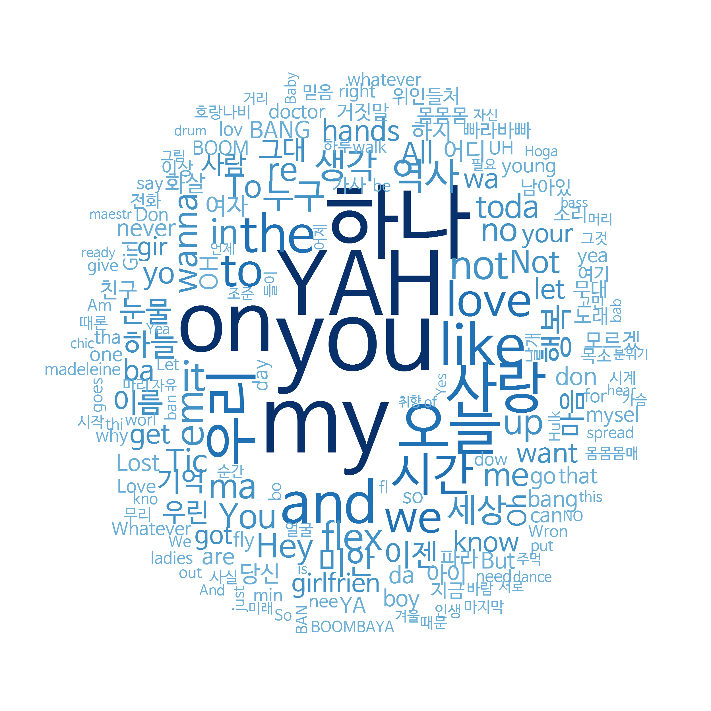
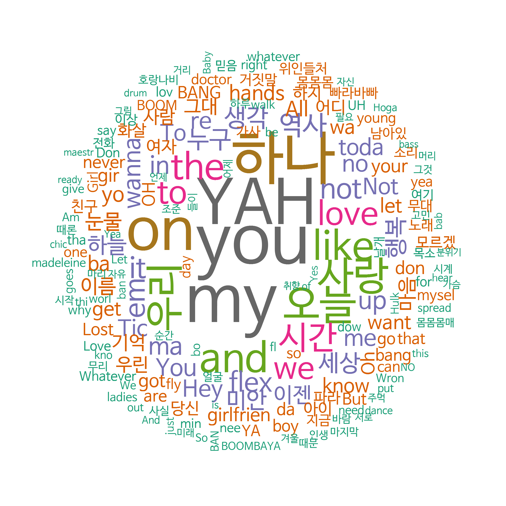
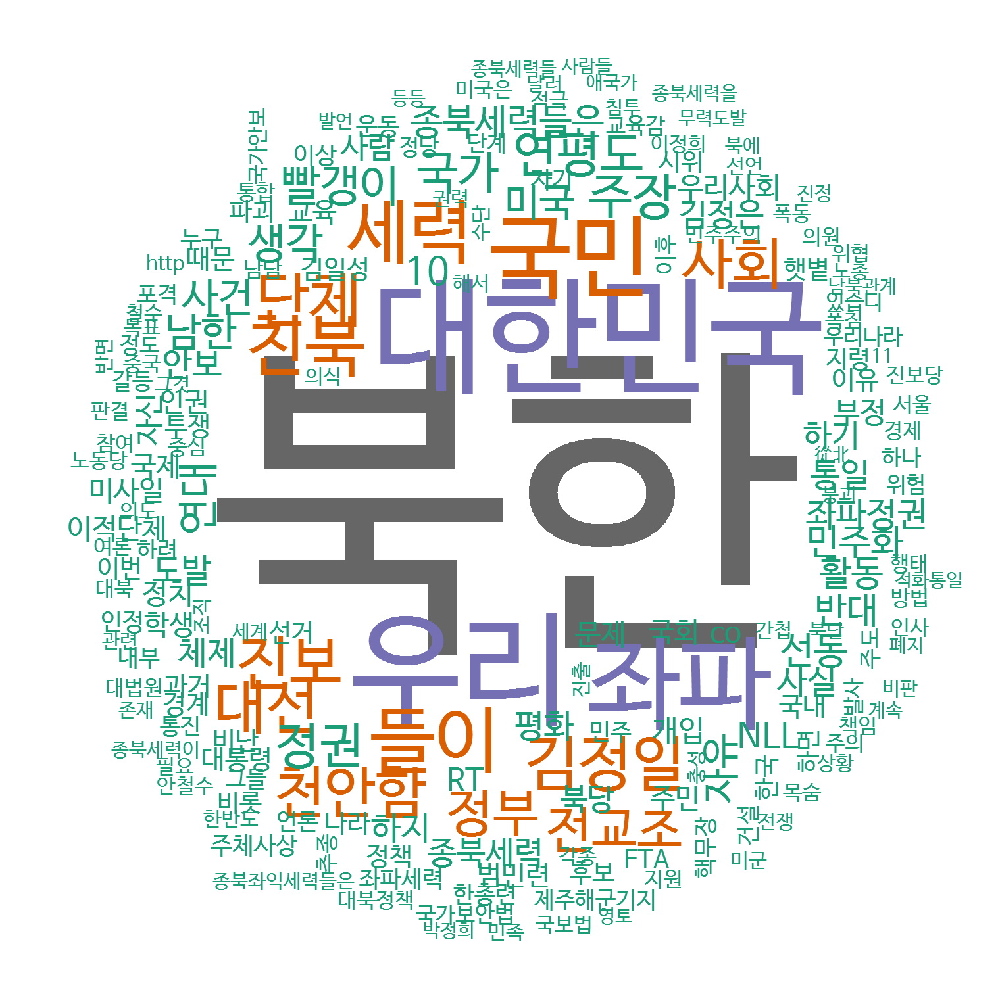
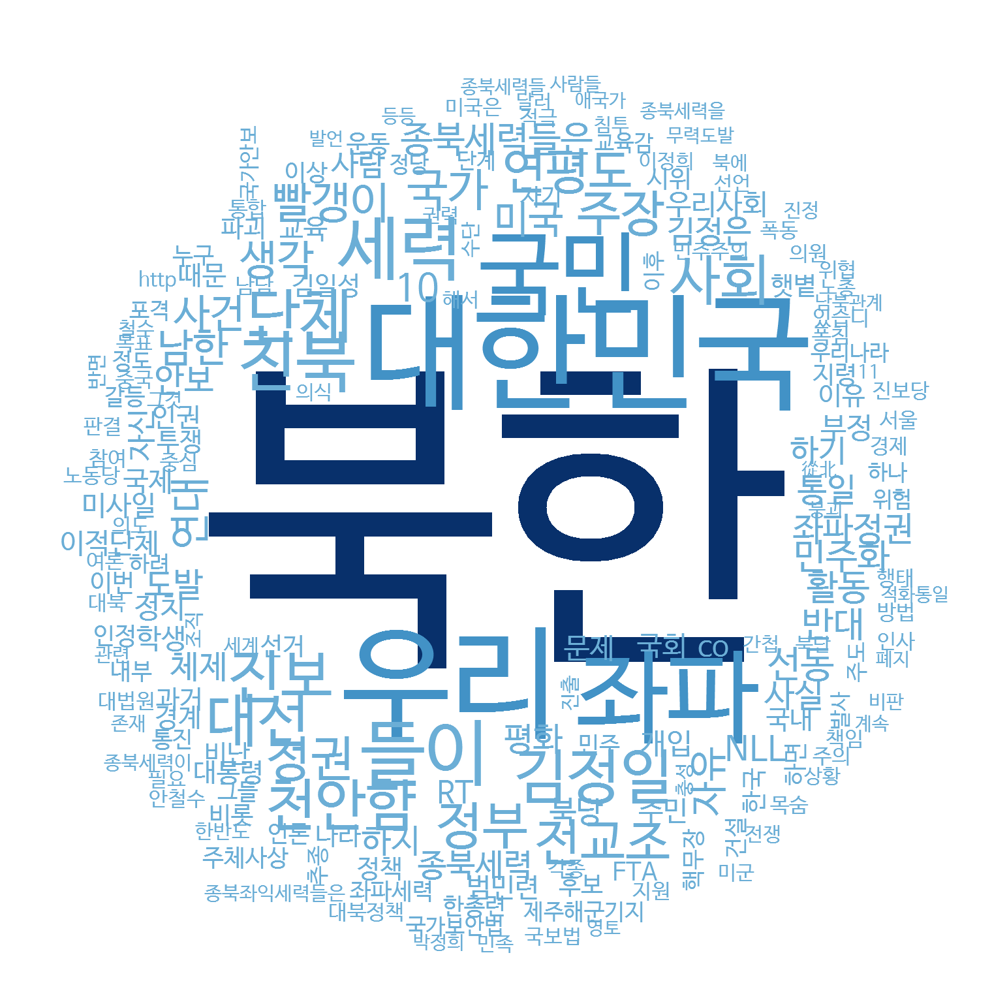

---
output:
  word_document: default
  html_document: default
---

<!-- RMD 설정 -->
```{r, include=F}
Sys.setenv("LANGUAGE"="EN")
library(dplyr)
library(ggplot2)
```

# 10. 텍스트 마이닝



##### NP #####

#### 텍스트 마이닝(Text mining)

- 문자로 된 데이터에서 가치 있는 정보를 얻어 내는 분석 기법

- SNS나 웹 사이트에 올라온 글을 분석해 사람들이 어떤 이야기를 나누고 있는지 파악할 때 활용

- 형태소 분석(Morphology Analysis) : 문장을 구성하는 어절들이 어떤 품사로 되어 있는지 분석

* 분석 절차
    + 형태소 분석
    + 명사, 동사 형용사 등 의미를 지닌 품사 단어 추출
    + 빈도표 만들기
    + 시각화

##### NP #####

## 10-1. 힙합 가사 텍스트 마이닝

### 텍스트 마이닝 준비하기

#### Java 다운로드 및 설치

[https://www.java.com/ko/download/manual.jsp](https://www.java.com/ko/download/manual.jsp)

##### NP #####

#### 패키지 설치 및 로드
```{r, eval=F}
# 패키지 설치
install.packages("rJava")
install.packages("memoise")
install.packages("KoNLP")
```

```{r}
# 패키지 로드
library(KoNLP)
library(dplyr)
```

#### 패키지 로드 에러 발생할 경우 - java 설치 경로 확인 후 경로 설정
```{r, eval=F}
# java 폴더 경로 설정
Sys.setenv(JAVA_HOME="C:/Program Files/Java/jre1.8.0_111/")
```

##### NP #####

#### 사전 설정하기
```{r}
useNIADic()
```

#### 데이터 준비
```{r}
# 데이터 불러오기
txt <- readLines("hiphop.txt")
head(txt)
```

##### NP #####

#### 특수문자 제거
```{r, eval=F}
install.packages("stringr")
```

```{r}
library(stringr)

# 특수문제 제거
txt <- str_replace_all(txt, "\\W", " ")
```

##### NP #####

### 가장 많이 사용된 단어 알아보기
```{r}
# 명사 추출하기
extractNoun("대한민국의 영토는 한반도와 그 부속도서로 한다")
```

```{r}
# 가사에서 명사추출
nouns <- extractNoun(txt)

# 추출한 명사 list를 문자열 벡터로 변환, 단어별 빈도표 생성
wordcount <- table(unlist(nouns))
```


##### NP #####

#### 자주 사용된 단어 빈도표 만들기
```{r}
# 데이터 프레임으로 변환
df_word <- as.data.frame(wordcount, stringsAsFactors = F)

# 변수명 수정
df_word <- rename(df_word,
                  word = Var1,
                  freq = Freq)

# 두 글자 이상 단어 추출
df_word <- filter(df_word, nchar(word) >= 2)

top_20 <- df_word %>%
  arrange(desc(freq)) %>%
  head(20)
```

##### NP #####

```{r}
top_20
```

##### NP #####

### 워드 클라우드 만들기

#### 패키지 준비하기
```{r, eval=F}
# 패키지 설치
install.packages("wordcloud")
```

```{r}
# 패키지 로드
library(wordcloud)
library(RColorBrewer)
```

##### NP #####

### 워드 클라우드 만들기

#### 단어 색상 목록 만들기
```{r}
pal <- brewer.pal(8,"Dark2")  # Dark2 색상 목록에서 8개 색상 추출
```

#### 워드 클라우드 생성
```{r, message=F, warning=F, eval=F}
set.seed(1234)                   # 난수 고정
wordcloud(words = df_word$word,  # 단어
          freq = df_word$freq,   # 빈도
          min.freq = 2,          # 최소 단어 빈도
          max.words = 200,       # 표현 단어 수
          random.order = F,      # 고빈도 단어 중앙 배치
          rot.per = .1,          # 회전 단어 비율
          scale = c(4, 0.3),     # 단어 크기 범위
          colors = pal)          # 색깔 목록
```




##### NP #####

#### 단어 색상 바꾸기
```{r, message=F, warning=F, eval=F}
pal <- brewer.pal(9,"Blues")[5:9]  # 색상 목록 생성
set.seed(1234)                     # 난수 고정

wordcloud(words = df_word$word,    # 단어
          freq = df_word$freq,     # 빈도
          min.freq = 2,            # 최소 단어 빈도
          max.words = 200,         # 표현 단어 수
          random.order = F,        # 고빈도 단어 중앙 배치
          rot.per = .1,            # 회전 단어 비율
          scale = c(4, 0.3),       # 단어 크기 범위
          colors = pal)            # 색상 목록
```


##### NP #####

## 10-2. 국정원 트윗 텍스트 마이닝

- 국정원 계정 트윗 데이터
    + 국정원 대선 개입 사실이 밝혀져 논란이 됐던 2013년 6월, 독립 언론 뉴스타파가 인터넷을 통해 공개
    + 국정원 계정으로 작성된 3,744개 트윗


##### NP #####

### 국정원 트윗 텍스트 마이닝

#### 데이터 준비하기
```{r}
# 데이터 로드
twitter <- read.csv("twitter.csv",
                    header = T,
                    stringsAsFactors = F,
                    fileEncoding = "UTF-8")

# 변수명 수정
twitter <- rename(twitter,
                  no = 번호,
                  id = 계정이름,
                  date = 작성일,
                  tw = 내용)

# 특수문자 제거
twitter$tw <- str_replace_all(twitter$tw, "\\W", " ")
```

##### NP #####
```{r}
head(twitter$tw)
```

##### NP #####

#### 단어 빈도표 만들기
```{r}
# 트윗에서 명사추출
nouns <- extractNoun(twitter$tw)

# 추출한 명사 list를 문자열 벡터로 변환, 단어별 빈도표 생성
wordcount <- table(unlist(nouns))

# 데이터 프레임으로 변환
df_word <- as.data.frame(wordcount, stringsAsFactors = F)

# 변수명 수정
df_word <- rename(df_word,
                  word = Var1,
                  freq = Freq)
```

##### NP #####

#### 두 글자 이상으로 된 단어 추출, 빈도 상위 20개  단어 추출
```{r}
# 두 글자 이상 단어만 추출
df_word <- filter(df_word, nchar(word) >= 2)

# 상위 20개 추출
top20 <- df_word %>%
  arrange(desc(freq)) %>%
  head(20)
```

##### NP #####

```{r}
top20
```


##### NP #####

#### 단어 빈도 막대 그래프 만들기
```{r, message=F, warning=F}
library(ggplot2)

order <- arrange(top20, freq)$word               # 빈도 순서 변수 생성

ggplot(data = top20, aes(x = word, y = freq)) +
  ylim(0, 2500) +
  geom_col() +
  coord_flip() +
  scale_x_discrete(limit = order) +              # 빈도 순서 변수 기준 막대 정렬
  geom_text(aes(label = freq), hjust = -0.3)     # 빈도 표시
```

##### NP #####

#### 워드 클라우드 만들기
```{r, message=F, warning=F, eval=F}
pal <- brewer.pal(8,"Dark2")       # 색상 목록 생성
set.seed(1234)                     # 난수 고정

wordcloud(words = df_word$word,    # 단어
          freq = df_word$freq,     # 빈도
          min.freq = 10,           # 최소 단어 빈도
          max.words = 200,         # 표현 단어 수
          random.order = F,        # 고빈도 단어 중앙 배치
          rot.per = .1,            # 회전 단어 비율
          scale = c(6, 0.2),       # 단어 크기 범위
          colors = pal)            # 색상 목록
```




##### NP #####

#### 색깔 바꾸기
```{r, message=F, warning=F, eval=F}
pal <- brewer.pal(9,"Blues")[5:9]  # 색상 목록 생성
set.seed(1234)                     # 난수 고정

wordcloud(words = df_word$word,    # 단어
          freq = df_word$freq,     # 빈도
          min.freq = 10,           # 최소 단어 빈도
          max.words = 200,         # 표현 단어 수
          random.order = F,        # 고빈도 단어 중앙 배치
          rot.per = .1,            # 회전 단어 비율
          scale = c(6, 0.2),       # 단어 크기 범위
          colors = pal)            # 색상 목록
```


