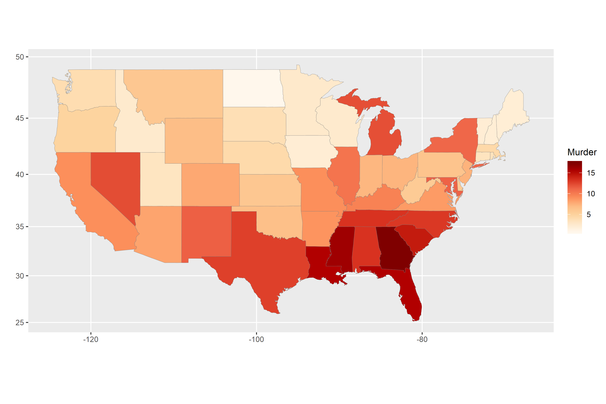

---
output:
  word_document: default
  html_document: default
---

<!-- RMD 설정 -->
```{r, include=F}
Sys.setenv("LANGUAGE"="EN")
library(dplyr)
library(ggplot2)
```

# 11. 지도 시각화




##### NP #####


#### 단계 구분도(Choropleth Map)

- 지역별 통계치를 색깔의 차이로 표현한 지도
- 인구나 소득 같은 특성이 지역별로 얼마나 다른지 쉽게 이해할 수 있음

##### NP #####

## 11-1. 미국 주별 강력 범죄율 단계 구분도 만들기

#### 패키지 준비하기
```{r, eval=F}
install.packages("ggiraphExtra")
```

```{r}
library(ggiraphExtra)
```

##### NP #####

#### 미국 주별 범죄 데이터 준비하기
```{r}
str(USArrests)
head(USArrests)

library(tibble)

# 행 이름을 state 변수로 바꿔 데이터 프레임 생성
crime <- rownames_to_column(USArrests, var = "state")

# 지도 데이터와 동일하게 맞추기 위해 state의 값을 소문자로 수정
crime$state <- tolower(crime$state)

str(crime)
```

##### NP #####

#### 미국 주 지도 데이터 준비하기

```{r}
library(ggplot2)
states_map <- map_data("state")
str(states_map)
```

##### NP #####

#### 단계 구분도 만들기
```{r}
ggChoropleth(data = crime,         # 지도에 표현할 데이터
             aes(fill = Murder,    # 색깔로 표현할 변수
                 map_id = state),  # 지역 기준 변수
             map = states_map)     # 지도 데이터
```

#### 인터랙티브 단계 구분도 만들기
```{r, eval=F}
ggChoropleth(data = crime,         # 지도에 표현할 데이터
             aes(fill = Murder,    # 색깔로 표현할 변수
                 map_id = state),  # 지역 기준 변수
             map = states_map,     # 지도 데이터
             interactive = T)      # 인터랙티브
```

##### NP #####

## 11-2. 대한민국 시도별 인구, 결핵 환자 수 단계 구분도 만들기

### 대한민국 시도별 인구 단계 구분도 만들기

#### 패키지 준비하기
```{r, eval=F}
install.packages("stringi")

install.packages("devtools")
devtools::install_github("cardiomoon/kormaps2014")
```

```{r}
library(kormaps2014)
```

##### NP #####

#### 대한민국 시도별 인구 데이터 준비하기
```{r}
str(changeCode(korpop1))

```

##### NP #####

```{r}
library(dplyr)
korpop1 <- rename(korpop1,
                  pop = 총인구_명,
                  name = 행정구역별_읍면동)

str(changeCode(kormap1))
```

##### NP #####

#### 단계 구분도 만들기

<!-- 출력용 -->
```{r, eval=F}
ggChoropleth(data = korpop1,       # 지도에 표현할 데이터
             aes(fill = pop,       # 색깔로 표현할 변수
                 map_id = code,    # 지역 기준 변수
                 tooltip = name),  # 지도 위에 표시할 지역명
             map = kormap1,        # 지도 데이터
           interactive = T)        # 인터랙티브
```

<!-- 실행용 -->
```{r, echo=F}
ggChoropleth(data = korpop1,       # 지도에 표현할 데이터
             aes(fill = pop,       # 색깔로 표현할 변수
                 map_id = code,    # 지역 기준 변수
                 tooltip = name),  # 지도 위에 표시할 지역명
             map = kormap1)        # 지도 데이터
```


##### NP #####

### 대한민국 시도별 결핵 환자 수 단계 구분도 만들기

<!-- 출력용 -->
```{r, eval=F}
str(changeCode(tbc))
```

<!-- 실행용 -->
```{r, echo=F}
str(changeCode(tbc))
```

##### NP #####

<!-- 출력용 -->
```{r, eval=F}
ggChoropleth(data = tbc,           # 지도에 표현할 데이터
             aes(fill = NewPts,    # 색깔로 표현할 변수
                 map_id = code,    # 지역 기준 변수
                 tooltip = name),  # 지도 위에 표시할 지역명
             map = kormap1,        # 지도 데이터
             interactive = T)      # 인터랙티브
```

<!-- 실행용 -->
```{r, echo=F}
ggChoropleth(data = tbc,           # 지도에 표현할 데이터
             aes(fill = NewPts,    # 색깔로 표현할 변수
                 map_id = code,    # 지역 기준 변수
                 tooltip = name),  # 지도 위에 표시할 지역명
             map = kormap1)        # 지도 데이터
```

