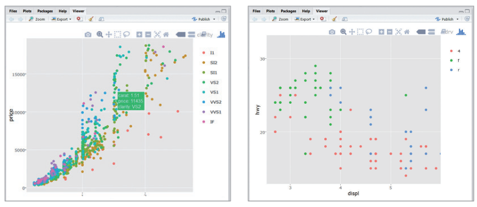
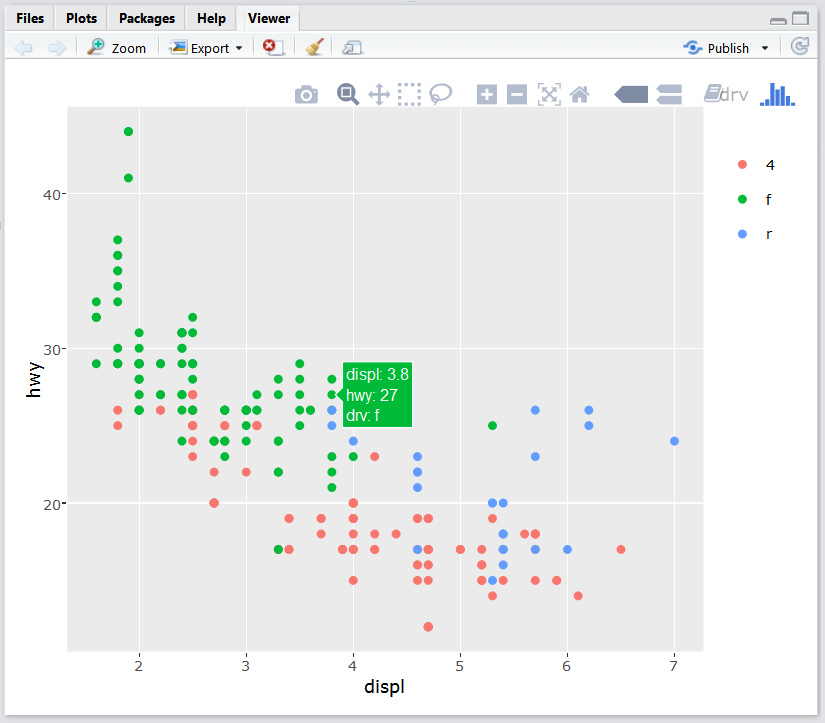
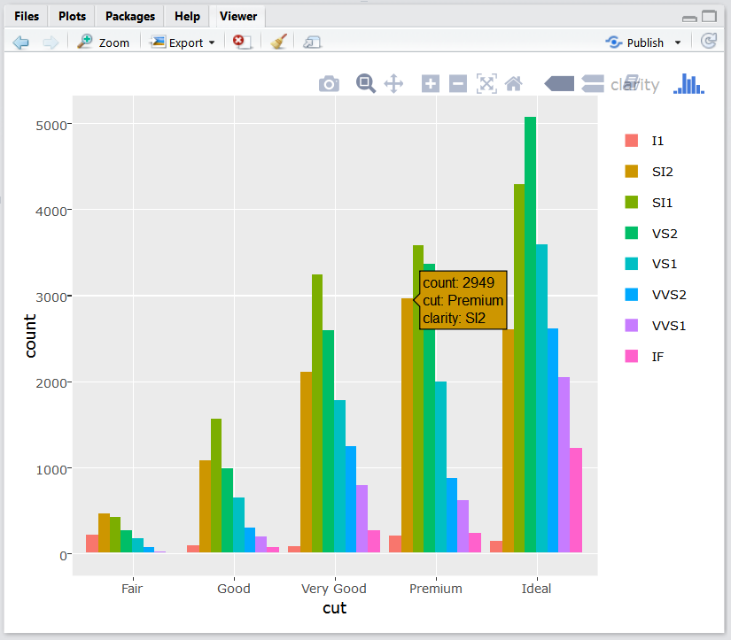
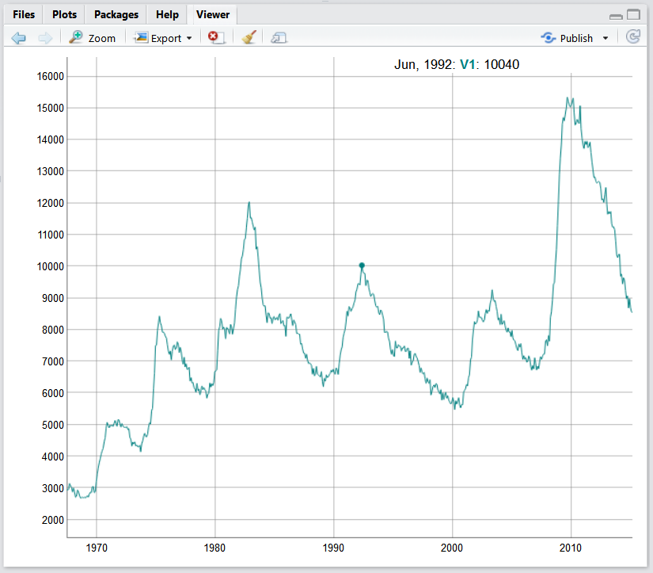
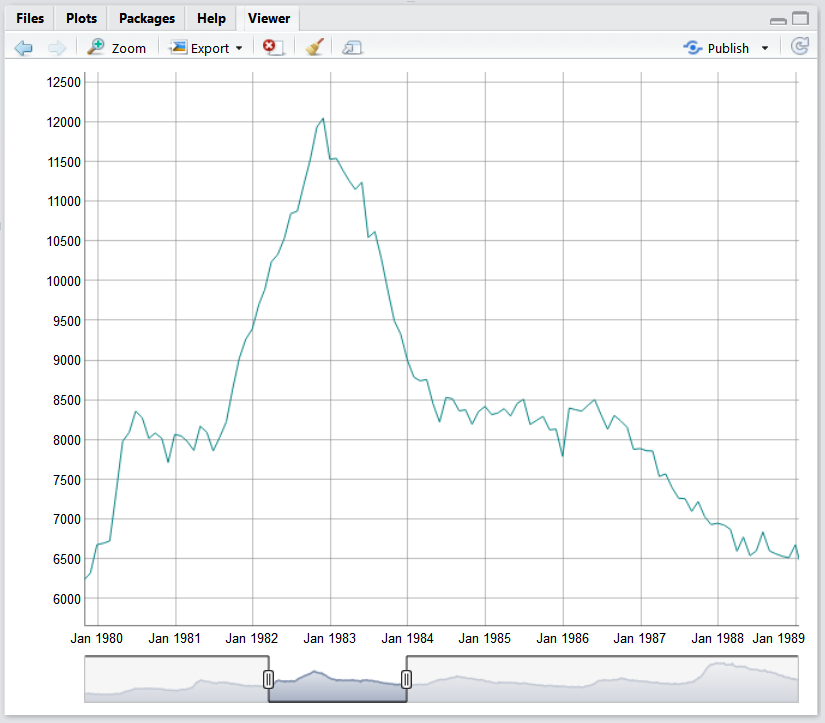
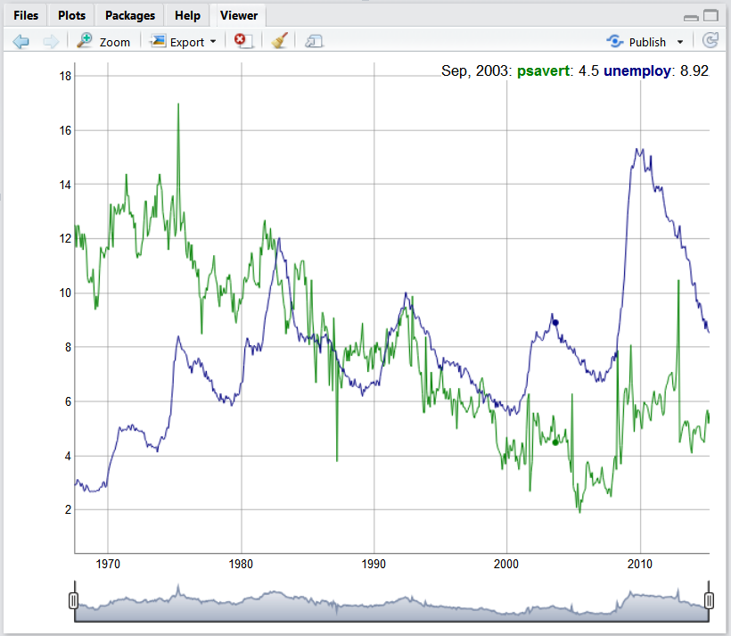

---
output:
  word_document: default
  html_document: default
---

<!-- RMD 설정 -->
```{r, include=F}
Sys.setenv("LANGUAGE"="EN")
library(dplyr)
library(ggplot2)
```

# 12. 인터랙티브 그래프



##### NP #####

## 12-1. plotly 패키지로 인터랙티브 그래프 만들기

### 인터랙티브 그래프 만들기

#### 패키지 준비하기
```{r, eval=F}
install.packages("plotly")
```

```{r, message=F, warning=F}
library(plotly)
```

##### NP #####

#### ggplot으로 그래프 만들기
```{r, eval=F}
library(ggplot2)
p <- ggplot(data = mpg, aes(x = displ, y = hwy, col = drv)) + geom_point()
```

##### NP #####

#### 인터랙티브  그래프 만들기
```{r, eval=F}
ggplotly(p)
```



##### NP #####

#### 인터랙티브 막대 그래프 만들기
```{r, eval=F}
p <- ggplot(data = diamonds, aes(x = cut, fill = clarity)) + 
  geom_bar(position = "dodge")

ggplotly(p)
```



##### NP #####

## 12-2. dygraphs 패키지로 인터랙티브 시계열 그래프 만들기

### 인터랙티브 시계열 그래프 만들기

#### 패키지 준비하기
```{r, eval=F}
install.packages("dygraphs")
```
```{r, warning=F, message=F}
library(dygraphs)
```

##### NP #####

#### 데이터 준비하기
```{r}
economics <- ggplot2::economics
head(economics)
```

##### NP #####

#### 시간 순서 속성을 지니는 `xts` 데이터 타입으로 변경
```{r, message=F}
library(xts)

eco <- xts(economics$unemploy, order.by = economics$date)
head(eco)
```

##### NP #####

#### 인터랙티브 시계열 그래프 만들기
```{r, eval=F}
# 그래프 생성
dygraph(eco)
```




##### NP #####

#### 날짜 범위 선택 기능
```{r, eval=F}
dygraph(eco) %>% dyRangeSelector()
```



##### NP #####

#### 여러 값 표현하기

```{r}
# 저축률 
eco_a <- xts(economics$psavert, order.by = economics$date)

# 실업자 수
eco_b <- xts(economics$unemploy/1000, order.by = economics$date)
```

#### 합치기
```{r}
eco2 <- cbind(eco_a, eco_b)                 # 데이터 결합
colnames(eco2) <- c("psavert", "unemploy")  # 변수명 바꾸기
head(eco2)
```

##### NP #####

#### 그래프 만들기
```{r, eval=F}
dygraph(eco2) %>% dyRangeSelector()
```

