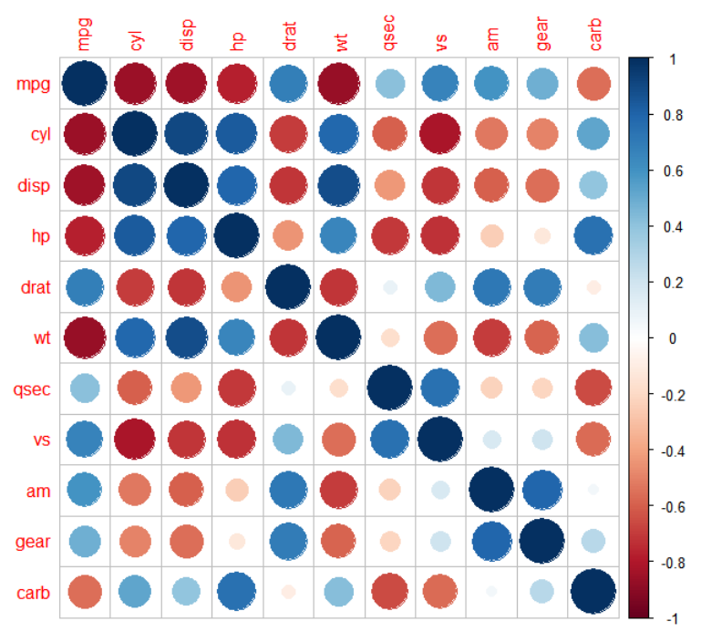
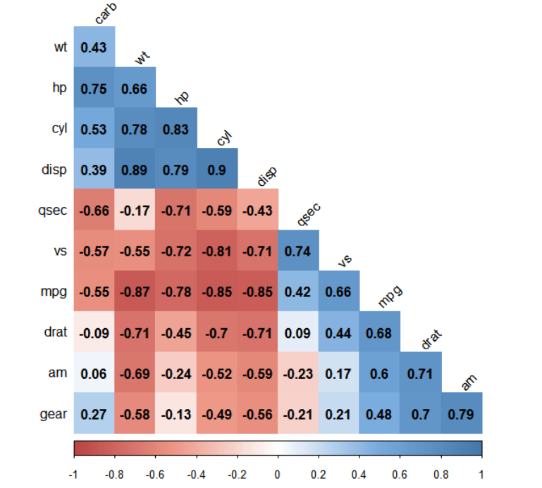

---
output:
  word_document: default
  html_document: default
---

<!-- RMD 설정 -->
```{r, include=F}
Sys.setenv("LANGUAGE"="EN")
library(dplyr)
library(ggplot2)
```

# 13. 통계 분석 기법을 이용한 가설 검정


##### NP #####


## 13-1. 통계적 가설 검정이란?

#### 기술 통계와 추론 통계

- **기술 통계(Descriptive statistics)**
    + 데이터를 요약해 설명하는 통계 기법
    + ex) 사람들이 받는 월급을 집계해 전체 월급 평균 구하기

- **추론 통계(Inferential statistics)**
    + 단순히 숫자를 요약하는 것을 넘어 어떤 값이 발생할 확률을 계산하는 통계 기법
    + ex) 수집된 데이터에서 성별에 따라 월급에 차이가 있는 것으로 나타났을 때, 이런 차이가 우연히 발생할 확률을 계산
    
##### NP #####

- **추론 통계(Inferential statistics)**
    + 이런 차이가 우연히 나타날 확률이 작다
        + -> 성별에 따른 월급 차이가 통계적으로 유의하다(statistically significant)고 결론
    + 이런 차이가 우연히 나타날 확률이 크다
        + -> 성별에 따른 월급 차이가 통계적으로 유의하지 않다(not statistically significant)고 결론
    + 기술 통계 분석에서 집단 간 차이가 있는 것으로 나타났더라도 이는 우연에 의한 차이일 수 있음
        + 데이터를 이용해 신뢰할 수 있는 결론을 내리려면 유의확률을 계산하는 통계적 가설 검정 절차를 거쳐야 함


##### NP #####

#### 통계적 가설 검정

- **통계적 가설 검정(Statistical hypothesis test)**
    + 유의확률을 이용해 가설을 검정하는 방법

- **유의확률(Significance probability, p-value)**
    + 실제로는 집단 간 차이가 없는데 우연히 차이가 있는 데이터가 추출될 확률

    + 분석 결과 유의확률이 크게 나타났다면
        - '집단 간 차이가 통계적으로 유의하지 않다'고 해석
        - 실제로 차이가 없더라도 우연에 의해 이 정도의 차이가 관찰될 가능성이 크다는 의미

    + 분석 결과 유의확률이 작게 나타났다면
        - '집단 간 차이가 통계적으로 유의하다'고 해석
        - 실제로 차이가 없는데 우연히 이 정도의 차이가 관찰될 가
능성이 작다, 우연이라고 보기 힘들다는 의미

##### NP #####

### 13-2. t 검정 - 두 집단의 평균 비교

#### t 검정(t-test)

- 두 집단의 평균에 통계적으로 유의한 차이가 있는지 알아볼 때 사용하는 통계 분석 기법
    
##### NP #####

### compact 자동차와 suv 자동차의 도시 연비 t 검정

#### 데이터 준비
```{r}
mpg <- as.data.frame(ggplot2::mpg)

library(dplyr)
mpg_diff <- mpg %>% 
  select(class, cty) %>% 
  filter(class %in% c("compact", "suv"))

head(mpg_diff)
table(mpg_diff$class)
```

##### NP #####

#### t-test
```{r}
t.test(data = mpg_diff, cty ~ class, var.equal = T)
```

##### NP #####

### 일반 휘발유와 고급 휘발유의 도시 연비 t 검정

#### 데이터 준비
```{r}
mpg_diff2 <- mpg %>% 
  select(fl, cty) %>% 
  filter(fl %in% c("r", "p"))  # r:regular, p:premium

table(mpg_diff2$fl)
```

##### NP #####

#### t-test
```{r}
t.test(data = mpg_diff2, cty ~ fl, var.equal = T)
```

##### NP #####

## 13-3. 상관분석 - 두 변수의 관계성 분석

#### 상관분석(Correlation Analysis)

- 두 연속 변수가 서로 관련이 있는지 검정하는 통계 분석 
기법
- 상관계수(Correlation Coefficient)
    + 두 변수가 얼마나 관련되어 있는지, 관련성의 정도를 나타내는 값
    + 0~1 사이의 값을 지니고 1에 가까울수록 관련성이 크다는 의미
    + 상관계수가 양수면 정비례, 음수면 반비례 관계

##### NP #####

### 실업자 수와 개인 소비 지출의 상관관계

#### 데이터 준비
```{r}
economics <- as.data.frame(ggplot2::economics)
```

### 상관분석
```{r}
cor.test(economics$unemploy, economics$pce)
```


##### NP #####

### 상관행렬 히트맵 만들기

- 상관행렬(Correlation Matrix)
    - 여러 변수 간 상관계수를 행렬로 타나낸 표
    - 어떤 변수끼리 관련이 크고 적은지 파악할 수 있음
    
##### NP #####

#### 데이터 준비
```{r}
head(mtcars)
```

##### NP #####

#### 상관행렬 만들기
```{r}
car_cor <- cor(mtcars)  # 상관행렬 생성
round(car_cor, 2)       # 소수점 셋째 자리에서 반올림해서 출력
```

##### NP #####

#### 상관행렬 히트맵 만들기

- 히트맵(heat map) : 값의 크기를 색깔로 표현한 그래프
```{r, eval=F}
install.packages("corrplot")
library(corrplot)
```

##### NP #####

```{r, eval=F}
corrplot(car_cor)
```



##### NP #####

#### 원 대신 상관계수 표시
```{r, eval=F}
corrplot(car_cor, method = "number")
```


##### NP #####

#### 다양한 파라미터 지정하기
```{r, eval=F}
col <- colorRampPalette(c("#BB4444", "#EE9988", "#FFFFFF", "#77AADD", "#4477AA"))

corrplot(car_cor,
         method = "color",       # 색깔로 표현
         col = col(200),         # 색상 200개 선정
         type = "lower",         # 왼쪽 아래 행렬만 표시
         order = "hclust",       # 유사한 상관계수끼리 군집화
         addCoef.col = "black",  # 상관계수 색깔
         tl.col = "black",       # 변수명 색깔
         tl.srt = 45,            # 변수명 45도 기울임
         diag = F)               # 대각 행렬 제외
```

