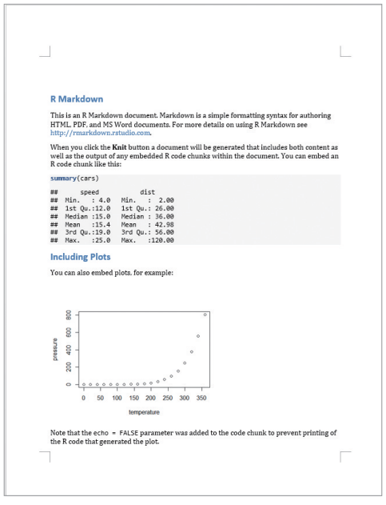
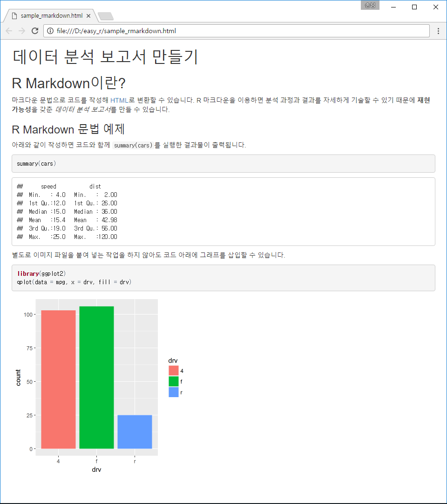
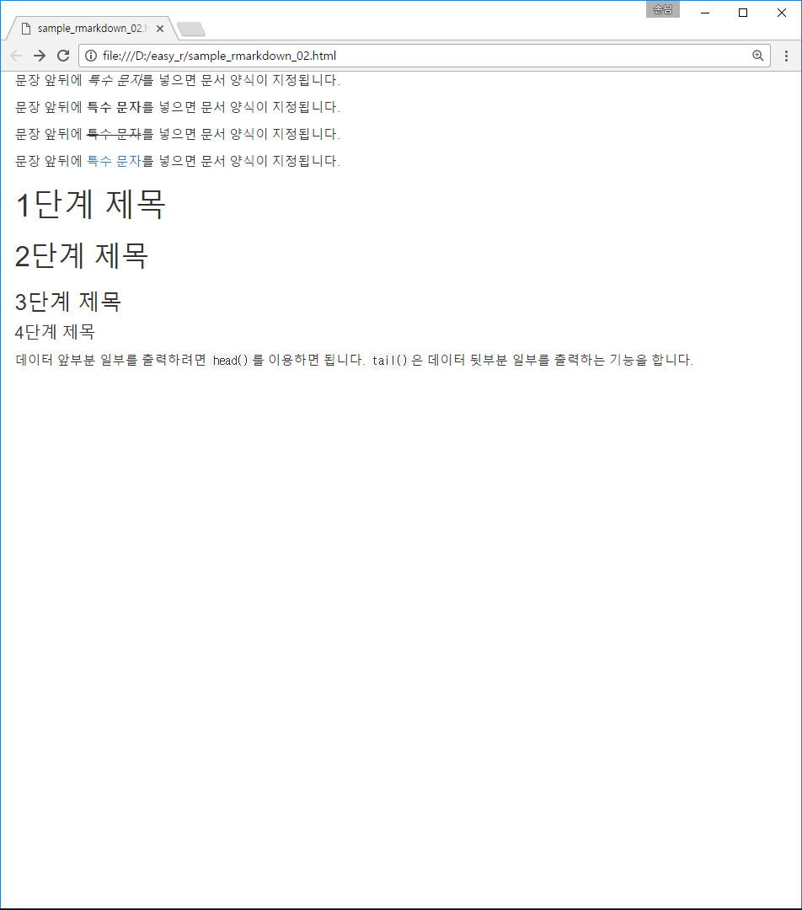
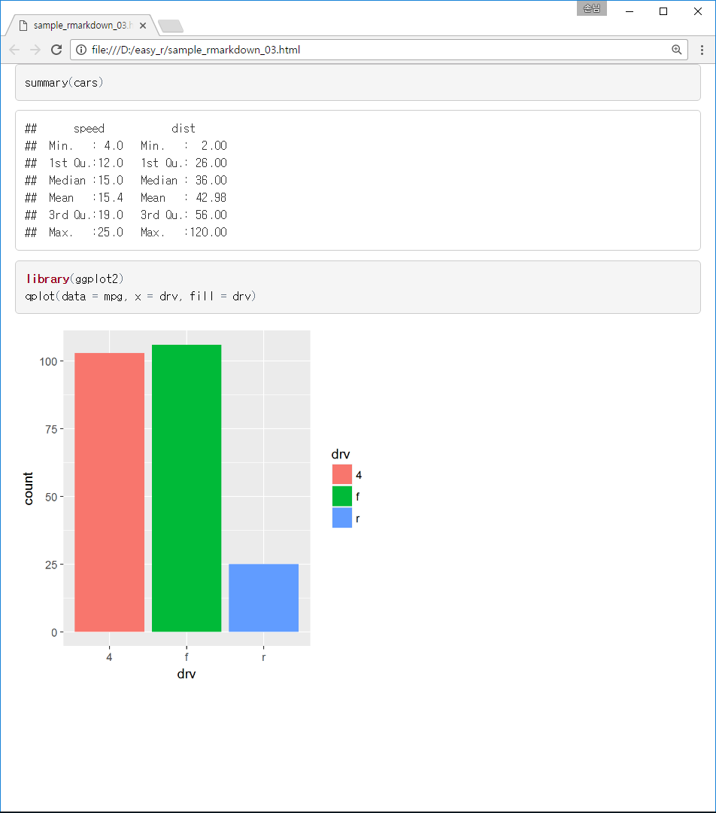

---
output:
  word_document: default
  html_document: default
---

<!-- RMD 설정 -->
```{r, include=F}
Sys.setenv("LANGUAGE"="EN")
```

# 14. R Markdown으로 데이터 분석 보고서 만들기



##### NP #####

## 14-1. 신뢰할 수 있는 데이터 분석 보고서 만들기

**신뢰할 수 있는 데이터 분석 보고서**

  - 코드와 결과물이 설명 글과 함께 어우러진 보고서
      + 독자가 분석 과정을 명확히 이해할 수 있음
      + 직접 코드를 실행하면서 동일한 결과가 도출되는지 확인 가능
      + 코드를 자신의 분석 작업에 활용 가능

  - 재현성(Reproducibility)을 갖춘 보고서
    + 동일한 분석 과정을 거쳤을 때 동일한 분석 결과가 반복되어 나옴


**R 마크다운(R Markdown)**

  - 마크다운 문법을 이용해 R 데이터 분석 보고서를 생성하는 기능
  - HTML, 워드, PDF 등 다양한 포맷으로 저장 가능, 별도 문서 작성 소프트웨어 없이 R로 보고서 작성 가능

##### NP #####

#### 마크다운 문법

    ## R 마크다운이란?
    
    마크다운 문법으로 코드를 작성해 [HTML](https://ko.wikipedia.org/wiki/HTML)로 변환할 수 있습니다. R 마크다운을 이용하면 분석 과정과 결과를 자세하게 기술할 수 있기 때문에 **재현 가능성**을 갖춘 *데이터 분석 보고서*를 만들 수 있습니다.
    
    ### R 마크다운 문법 예제
    
    아래와 같이 작성하면 코드와 함께 `summary(cars)`를 실행한 결과물이 출력됩니다.
    
    `r ''````{r}
    summary(cars)
    ```
    
    별도로 이미지 파일을 붙여 넣는 작업을 하지 않아도 코드 아래에 그래프를 삽입할 수 있습니다.
    
    `r ''````{r}
    library(ggplot2)
    qplot(data = mpg, x = drv, fill = drv)
    ```


#### HTML 출력 결과



### 양식 적용하기

#### 마크다운 문법


    문자 앞뒤에 *특수 문자*를 넣으면 기울임체가 됩니다.
    
    문자 앞뒤에 **특수 문자**를 넣으면 강조체가 됩니다.
    
    문자 앞뒤에 ~~특수 문자~~를 넣으면 취소선을 만듭니다.
    
    문자 앞뒤에 [특수 문자](http://www.google.com/search?q=special+character)를 넣으면 하이퍼링크를 만듭니다.
    
    # 1 단계 제목
    ## 2 단계 제목
    ### 3 단계 제목
    #### 4 단계 제목
    
    데이터 앞부분 일부를 출력하려면 `head()` 를 이용하면 됩니다. `tail()`은 데이터 뒷부분 일부를 출력하는 기능을 합니다.


#### HTML 출력 결과




##### NP #####

### 코드와 실행 결과

코드 청크(Code chunk) 안에 코드 입력(단축키 [Ctrl + Alt + I])

    `r ''````{r}
    summary(cars)
    library(ggplot2)
    qplot(data = mpg, x = drv, fill = drv)
    ```

##### NP #####

#### HTML 출력 결과


