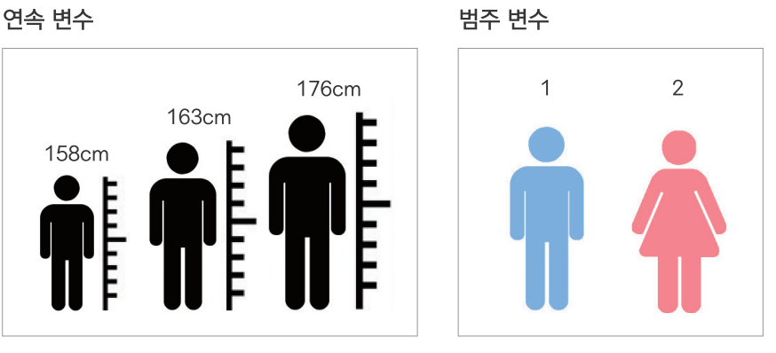

---
output:
  word_document: default
  html_document: default
---

<!-- RMD 설정 -->
```{r, include=F}
Sys.setenv("LANGUAGE"="EN")
library(dplyr)
library(ggplot2)
```


# 15. R 내장 함수, 변수 타입과 데이터 구조





##### NP #####

## 15-1. R 내장 함수로 데이터 추출하기

### 행 번호로 행 추출하기

#### 데이터 준비하기
```{r}
exam <- read.csv("csv_exam.csv")
```

##### NP #####

### 행 번호로 행 추출하기

대괄호안 쉼표 기준, 왼쪽에 행 번호(인덱스) 입력

- 인덱스(Index) : 데이터의 위치 또는 순서를 의미하는 값
- 인덱싱(Indexing) : 인덱스를 이용해 데이터를 추출하는 작업

    
```{r}
exam[]    # 조건 없이 전체 데이터 출력
```

##### NP #####

```{r}
exam[1,]  # 1행 추출
exam[2,]  # 2행 추출
```

##### NP #####

### 조건을 충족하는 행 추출하기
```{r}
exam[exam$class == 1,]  # class가 1인 행 추출
exam[exam$math >= 80,]  # 수학점수가 80점 이상인 행 추출
```

##### NP #####

```{r}
# 1반 이면서 수학점수가 50점 이상
exam[exam$class == 1 & exam$math >= 50,]

# 영어점수가 90점 미만이거나 과학점수가 50점 미만
exam[exam$english < 90 | exam$science < 50,]
```

##### NP #####

### 열 번호로 변수 추출하기

대괄호안 쉼표 오른쪽에 조건을 입력

```{r}
exam[,1]  # 첫 번째 열 추출
exam[,2]  # 두 번째 열 추출
exam[,3]  # 세 번째 열 추출

```

##### NP #####
  
### 변수명으로 변수 추출하기
```{r}
exam[, "class"]  # class 변수 추출
exam[, "math"]   # math 변수 추출
exam[,c("class", "math", "english")]  # class, math, english 변수 추출
```

##### NP #####

### 행, 변수 동시 추출하기

```{r}
# 행, 변수 모두 인덱스
exam[1,3]

# 행 인덱스, 열 변수명
exam[5, "english"]

# 행 부등호 조건, 열 변수명
exam[exam$math >= 50, "english"]

# 행 부등호 조건, 열 변수명
exam[exam$math >= 50, c("english", "science")]
```

##### NP #####

#### dplyr과 내장 함수의 차이

**문제) 수학 점수 50 이상, 영어 점수 80 이상인 학생들을 대상으로 각 반의 전 과목 총평균을 구하라.**

**내장 함수 코드**
```{r, eval=F}
exam$tot <- (exam$math + exam$english + exam$science)/3
aggregate(data=exam[exam$math >= 50 & exam$english >= 80,], tot~class, mean)
```

**dplyr 코드**
```{r, eval=F}
exam %>%
  filter(math >= 50 & english >= 80) %>%
  mutate(tot = (math + english + science)/3) %>%
  group_by(class) %>%
  summarise(mean = mean(tot))
```

##### NP #####

### 혼자서 해보기

`mpg` 데이터를 이용해서 분석 문제를 해결해 보세요.

아래는 `dplyr` 패키지 함수들을 이용해 `"compact"`와 `"suv"` 차종의 '도시 및 고속도로 통합 연비' 평균을 구하는 코드입니다.
```{r}
mpg <- as.data.frame(ggplot2::mpg)                 # mpg 데이터 불러오기

mpg %>%
  mutate(tot = (cty + hwy)/2) %>%                  # 통합 연비 변수 생성
  filter(class == "compact" | class == "suv") %>%  # compact, suv 추출
  group_by(class) %>%                              # class별 분리
  summarise(mean_tot = mean(tot))                  # tot 평균 산출
```

##### NP #####

Q1. `dplyr` 대신 R 내장 함수를 이용해 `"suv"`와 `"compact"`의 '도시 및 고속도로 통합 연비' 평균을 구해보세요.

#### 힌트

우선 `cty`와 `hwy`를 이용해 '통합 연비 변수'를 만드세요. 그런 다음, `class`가 `"compact"`인 행과 `"suv"`인 행을 추출해 두 종류의 데이터를 만드세요. 이렇게 만든 두 데이터를 이용해 통합 연비 변수 평균을 각각 구하면 됩니다.

##### NP #####

### 정답

Q1. `dplyr` 대신 R 내장 함수를 이용해 `"suv"`와 `"compact"`의 '도시 및 고속도로 통합 연비' 평균을 구해보세요.
```{r}
mpg$tot <- (mpg$cty + mpg$hwy)/2         # 통합 연비 변수 만들기

df_comp <- mpg[mpg$class == "compact",]  # compact 추출
df_suv <- mpg[mpg$class == "suv",]       # suv 추출

mean(df_comp$tot)                        # compact의 tot 평균 산출
mean(df_suv$tot)                         # suv의 tot 평균 산출
```

##### NP #####


## 15-2. 변수 타입

**변수에는 여러 가지 타입(Type, 속성)이 있음**

- 함수에 따라 적용 가능한 변수 타입 다름
- 분석 전에 변수 타입이 무엇인지 확인 필요
- 함수 실행했을 때 오류 발생 또는 예상과 다른 결과가 출력되면 변수 타입 확인 후 함수에 맞게 변경

##### NP #####

#### 변수의 종류 


- **1. 연속 변수(Continuous Variable) - Numeric 타입**
    - 값이 연속적이고 크기를 의미
    - 더하기 빼기, 평균 구하기 등 산술 가능
    - ex) 키, 몸무게, 소득

- **2. 범주 변수(Categorical Variable) - Factor 타입**
    - 값이 대상을 분류하는 의미를 지님
    - 산술 불가능
    - ex) 성별, 거주지

##### NP #####

변수     | Data Type | 예 
:-------:|:---------:|:---
연속 변수|Numeric    | 키(..., 151, 152, ...), 몸무게(..., 58, 59, ...)
범주 변수|Factor     | 성별(1, 2), 지역(1, 2, 3, 4)

##### NP #####

### 변수 타입 간 차이 알아보기
```{r}
var1 <- c(1,2,3,1,2)          # numeric 변수 생성
var2 <- factor(c(1,2,3,1,2))  # factor 변수 생성

var1  # numeric 변수 출력
var2  # factor 변수 출력
```

##### NP #####

```{r}
var1+2  # numeric 변수로 연산
var2+2  # factor 변수로 연산
```

##### NP #####

#### 변수 타입 확인하기
```{r}
class(var1)
class(var2)
```

##### NP #####

#### factor 변수의 구성 범주 확인하기
```{r}
levels(var1)
levels(var2)
```

##### NP #####

#### 문자로 구성된 factor 변수
```{r}
var3 <- c("a", "b", "b", "c")          # 문자 변수 생성
var4 <- factor(c("a", "b", "b", "c"))  # 문자로 된 factor 변수 생성

var3
var4

class(var3)
class(var4)
```

##### NP #####

#### 함수마다 적용 가능한 변수 타입이 다르다
```{r}
mean(var1)
mean(var2)
```

##### NP #####


### 변수 타입 바꾸기
```{r}
var2 <- as.numeric(var2)  # numeric 타입으로 변환
mean(var2)                # 함수 재적용
class(var2)               # 타입 확인
levels(var2)              # 범주 확인
```

##### NP #####


#### 변환 함수(Coercion Function)

함수            | 기능
----------------|---
as.numeric()    |numeric으로 변환
as.factor()     |factor로 변환
as.character()  |character로 변환
as.Date()       |Date로 변환
as.data.frame() |Data Frame으로 변환

##### NP #####

### 혼자서 해보기

`mpg` 데이터의 `drv` 변수는 자동차의 구동 방식을 나타냅니다. `mpg` 데이터를 이용해 아래 문제를 해결해 보세요.

- Q1. `drv` 변수의 타입을 확인해 보세요.
- Q2. `drv` 변수를 `as.factor()`를 이용해 `factor` 타입으로 변환한 후 다시 타입을 확인해 보세요.
- Q3. `drv`가 어떤 범주로 구성되는지 확인해 보세요.

##### NP #####

### 정답

```{r}
class(mpg$drv)                 # 타입 확인
mpg$drv <- as.factor(mpg$drv)  # factor로 변환
class(mpg$drv)                 # 타입 확인
levels(mpg$drv)                # 범주 확인
```


##### NP #####


## 15-3. 데이터 구조

- 데이터 프레임 외에도 다양한 데이터 구조가 있음
- 데이터 구조에 따라 활용 방법 다름

데이터 구조               |차원   |특징
--------------------------|:-----:|---
벡터(Vactor)              | 1차원 | 한 가지 변수 타입으로 구성
데이터 프레임(Data Frame) | 2차원 | 다양한 변수 타입으로 구성
매트릭스(Matrix)          | 2차원 | 한 가지 변수 타입으로 구성
어레이(Array)             | 다차원| 2차원 이상의 매트릭스
리스트(List)              | 다차원| 서로 다른 데이터 구조 포함 


##### NP #####


### 데이터 구조 비교하기

#### 1. 벡터(Vactor)

- 하나 또는 여러 개의 값으로 구성된 데이터 구조
- 여러 타입을 섞을 수 없고, 한 가지 타입으로만 구성 가느
```{r}
# 벡터 만들기
a <- 1
a

b <- "hello"
b

# 데이터 구조 확인 
class(a)
class(b)
```

##### NP #####

#### 2. 데이터 프레임(Data Frame)
- 행과 열로 구성된 2차원 데이터 구조
- 다양한 변수 타입으로 구성 가능
```{r}
# 데이터 프레임 만들기
x1 <- data.frame(var1 = c(1,2,3),
                 var2 = c("a","b","c"))
x1

# 데이터 구조 확인
class(x1)

```

##### NP #####

#### 3. 매트릭스(Matrix)
- 행과 열로 구성된 2차원 데이터 구조
- 한 가지 타입으로만 구성 가능

```{r}
# 매트릭스 만들기 - 1~12로 2열
x2 <- matrix(c(1:12), ncol = 2)
x2

# 데이터 구조 확인
class(x2)
```

##### NP #####

#### 4. 어레이(Array)
- 2차원 이상으로 구성된 매트릭스
- 한 가지 타입으로만 구성 가능
```{r}
# array 만들기 - 1~20으로 2행 x 5열 x 2차원
x3 <- array(1:20, dim = c(2, 5, 2))
x3
```

##### NP #####

#### 5. 리스트(List)
- 모든 데이터 구조를 포함하는 데이터 구조
- 여러 데이터 구조를 합해 하나의 리스트로 구성 가능

```{r}
# 리스트 생성 - 앞에서 생성한 데이터 구조 활용
x4 <- list(f1 = a,   # 벡터
           f2 = x1,  # 데이터 프레임
           f3 = x2,  # 매트릭스
           f4 = x3)  # 어레이
x4

# 데이터 구조 확인
class(x4)
```

##### NP #####

#### 리스트 활용
- 함수의 결과물이 리스트 형태로 반환되는 경우 많음
- 리스트를 활용하면 함수의 결과물에서 특정 값을 추출 가능

**boxplot() 출력 결과물에서 값 추출하기**
```{r}
mpg <- ggplot2::mpg
x <- boxplot(mpg$cty)
x
```

##### NP #####
```{r}
x$stats[,1]     # 요약 통계량 추출

x$stats[,1][3]  # 중앙값 추출

x$stats[,1][2]  # 1분위수 추출
```

##### NP #####

### 정리하기

```{r, eval=F}
# 1.데이터 추출하기
exam[1,]                                  # 행 번호로 행 추출
exam[exam$class == 1,]                    # 조건을 충족하는 행 추출
exam[exam$class == 1 & exam$math >= 50,]  # 여러 조건을 충족하는 행 추출

exam[,1]                                  # 열 번호로 변수 추출
exam[, "class"]                           # 변수명으로 변수 추출
exam[,c("class", "math", "english")]      # 변수명으로 여러 변수 추출
exam[1,3]                                 # 행, 변수 동시 추출 - 인덱스
exam[exam$math >= 50, "english"]          # 행, 변수 동시 추출 - 조건문, 변수명


# 2.변수 타입
var <- c(1,2,3,1,2)                   # numeric 변수 만들기
var <- factor(c(1,2,3,1,2))           # factor 변수 만들기
var <- factor(c("a", "b", "b", "c"))  # 문자로 구성된 factor 변수 만들기
 
class(var)                            # 변수 타입 확인하기
levels(var)                           # factor 변수의 구성 범주 확인
var <- as.numeric(var)                # factor 타입을 numeric 타입으로 변환하기

```

##### NP #####

### 정리하기

```{r, eval=F}
# 3.데이터 구조
a <- 1                                   # 벡터 만들기
b <- "hello"

x1 <- data.frame(var1 = c(1,2,3),        # 데이터 프레임 만들기
                 var2 = c("a","b","c"))

x2 <- matrix(c(1:12), ncol = 2)          # 매트릭스 만들기

x3 <- array(1:20, dim=c(2, 5, 2))        # 어레이 만들기

x4 <- list(f1 = a,                       # 리스트 만들기
           f2 = x1,
           f3 = x2,
           f4 = x3)

# 리스트 활용하기
x <- boxplot(mpg$cty)  # 상자 그림 만들기
x$stats[,1]            # 요약 통계량 추출
```

