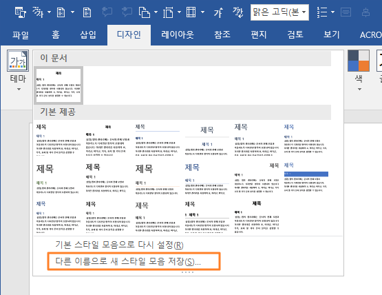

# R 강의용 프리젠테이션 자료

- <쉽게 배우는 R 데이터 분석>을 강의 교재로 사용하시는 분들을 위한 프리젠테이션 자료입니다.

- [Lecture.zip](https://github.com/youngwoos/Doit_R/blob/master/Lecture/Lecture.zip)을 다운받으면 전체 파일을 한 번에 받으실 수 있습니다.

- 프리젠테이션 파일은 `RMarkdown`으로 워드 파일을 생성해 만들었습니다. 자료를 수정하시려면 워드에서 수정하셔도 되고, R 스튜디오에서 RMD 파일을 수정한 후 워드 파일을 생성하셔도 됩니다.

    - `RMarkdown` 사용 방법은 14장 'R Markdown으로 데이터 분석 보고서 만들기'를 참고하세요.

## 프리젠테이션용 파일 만드는 방법

RMD 파일을 수정할 경우, 워드 파일을 생성한 후 아래 절차에 따라 변경하면 프리젠테이션에 적합하게 만들 수 있습니다. 

### 1. 워드 스타일 적용
1. [RMD](https://github.com/youngwoos/Doit_R/tree/master/Lecture/RMD) 폴더의 `WordTemplate.dotx`를 워드 템플릿 폴더에 삽입
2.	워드 파일을 열어 [디자인] → [문서서식] → [사용자 지정] → 'WordTemplate' 클릭

> 워드에서 [Alt + G + S]를 누른 후 [다른 이름으로 새 스타일 모음 저장]을 클릭하면 템플릿 폴더 위치를 확인할 수 있습니다.

  

### 2. 포멧 수정
1. 여백 줄이기   : [레이아웃] → [여백] → [좁게]
2. 가로로 바꾸기 : [레이아웃] → [용지방향] → [가로]
3. 용지 바꾸기   : [레이아웃] → [크기] → [A4]
4. 폰트 키우기   : [Ctrl + A]로 전체 선택 → [Ctrl + Shift + >] × 3회

### 3. PDF로 저장
[파일] → [다른 이름으로 저장] → 파일 형식 'PDF' 선택 → 저장

## RMD 파일의 페이지 넘김 표시

RMD 파일을 열어보시면 페이지 넘김 표시 `##### NP #####`가 삽입되어 있습니다. 마크다운 5단계 헤더를 워드 스타일을 이용해 페이지 넘김 기능으로 활용하기 위해 삽입한 것입니다. 워드 파일을 생성하면 페이지 넘김 표시가 NP 로 출력되는데, `WordTemplate.dotx`를 이용해 스타일을 적용하면 해당 부분에서 페이지가 넘어갑니다.

- 참고 : [R Markdown: How to insert page breaks in a MS Word document](https://datascienceplus.com/r-markdown-how-to-insert-page-breaks-in-a-ms-word-document/)

자료와 관련하여 궁금한 사항이 있으시면 메일로 문의해주세요.

stats7445@gmail.com
