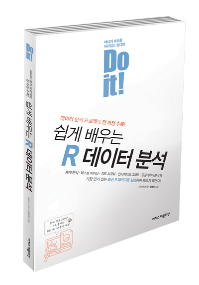

<Do it! 쉽게 배우는 R 데이터 분석> 저장소
---

- 예스24 [[바로가기]](http://www.yes24.com/Product/Goods/43868089)
- 알라딘 [[바로가기]](https://www.aladin.co.kr/shop/wproduct.aspx?ISBN=K382531391&start=pnaver_02)
- 교보문고 [[바로가기]](http://www.kyobobook.co.kr/product/detailViewKor.laf?mallGb=KOR&ejkGb=KOR&linkClass=&barcode=9791187370949)

---

폴더           | 내용
:------------- |:-------------
[Data](https://github.com/youngwoos/Doit_R/tree/master/Data) | 실습 데이터 파일
[Script](https://github.com/youngwoos/Doit_R/tree/master/Script) | 본문 R 스크립트, 분석 도전 정답
[Lecture](https://github.com/youngwoos/Doit_R/tree/master/Lecture) | 강의용 프리젠테이션 자료

- 저장소의 모든 자료를 한 번에 다운로드하려면 다음 [링크](https://github.com/youngwoos/Doit_R/archive/master.zip)를 클릭하세요.
- 한국복지패널데이터는 다음 [링크](http://bit.ly/Koweps_hpc10_2015_v2)를 클릭하면 다운받을 수 있습니다.

---

## 질문하기
궁금한 점이 있으면 페이스북 [데이터 분석 커뮤니티](https://www.facebook.com/groups/datacommunity)에 질문을 올려 주세요. 데이터 분석을 공부하는 사람들과 질문과 답변을 주고받으며 함께 공부할 수 있습니다.  질문할 때 작성한 코드나 캡처 이미지를 함께 올려 주시면 답변하는 데 도움이 됩니다.

## 기타 문의
다른 문의 사항은 stats7445@gmail.com으로 메일을 보내주세요.
